---
tags:
  - recursive-thinking-patterns
  - causal-chain-analysis
  - abstract-conceptual-framework
  - hierarchical-knowledge-structures
  - meta-concept-discovery
  - cross-domain-integration
  - system-level-reasoning
  - emergent-properties
  - conceptual-hierarchy-decomposition
  - principle-based-insights
  - formal-informal-reasoning
  - domain-specific-adaptation
  - universal-pattern-recognition
  - translational-bridges
  - novel-combination-of-ideas
  - deep-semantical-tagging
  - integrative-reasoning-process
  - cognitive-evolution-pathways
  - semantic-richness-density
  - abstraction-hierarchy-building
  - "#S17_OverlaySemanticWeight"
category: Training & Performance
description: Describes methods for enhancing AI long‑term memory using overlay architecture, external semantic weight tables, and selective neural selectors to store, retrieve, and update knowledge efficiently with constant‑time complexity.
title: AI Enhanced Long Term Memory Training
Receptor: |-
  The following scenarios describe where this note would be activated or become relevant in practical contexts:

  Scenario 1: Adaptive Sports Training Optimization
  Context: A professional athlete's training program requires real-time adjustment based on performance metrics and memory retention patterns. The system identifies when an athlete is experiencing memory decay during skill repetition, triggering AI algorithms to modify training intervals.
  Actors: Athlete, coach, AI training system, neurofeedback sensors.
  Expected Outcomes: Improved skill retention, reduced fatigue-related errors, optimized training efficiency.
  Consequences: Enhanced performance outcomes and personalized training protocols that adapt to individual cognitive rhythms.
  Triggering Conditions: High-accuracy sensor data showing declining memory recall, performance plateaus exceeding baseline thresholds.
  Real-world Example: Professional basketball players using AI-assisted practice sessions where machine learning models adjust repetition timing based on neural activity patterns.
  Semantic Pathway: Connects LTM concepts with sports training methodologies through neurofeedback integration and adaptive scheduling algorithms.

  Scenario 2: Personalized Educational Learning Systems
  Context: An educational platform needs to customize content delivery for individual students based on their memory consolidation rates and learning patterns.
  Actors: Student, AI tutor system, curriculum database, performance tracking tools.
  Expected Outcomes: Improved retention rates, reduced study time requirements, enhanced comprehension accuracy.
  Consequences: More effective educational outcomes with adaptive learning paths that optimize information absorption timing.
  Triggering Conditions: Student performance data indicating memory decay patterns, low recall scores in recent assessments.
  Real-world Example: Online learning platforms like Khan Academy integrating AI to schedule review sessions based on spaced repetition algorithms.
  Semantic Pathway: Links cognitive memory theory with educational technology through personalized scheduling and content optimization.

  Scenario 3: Professional Skill Development Coaching
  Context: A corporate training program requires continuous monitoring of knowledge retention for complex skill acquisition programs.
  Actors: Employee, AI coaching system, training curriculum, performance analytics dashboard.
  Expected Outcomes: Increased proficiency rates, reduced retraining needs, enhanced job performance metrics.
  Consequences: Better organizational outcomes through optimized learning efficiency and sustained skill development.
  Triggering Conditions: Performance gaps identified in competency assessments, declining retention scores over time periods.
  Real-world Example: Medical training programs using AI to schedule knowledge refresh sessions for doctors based on memory decay predictions.
  Semantic Pathway: Integrates professional development frameworks with cognitive neuroscience principles via predictive modeling.

  Scenario 4: Cognitive Rehabilitation Therapy Systems
  Context: A patient undergoing rehabilitation needs personalized memory restoration protocols that account for neural recovery patterns.
  Actors: Patient, AI therapy system, neurologist, brain imaging sensors.
  Expected Outcomes: Accelerated recovery times, improved cognitive function scores, reduced therapy duration requirements.
  Consequences: More effective therapeutic outcomes through precision-timed interventions based on individual recovery profiles.
  Triggering Conditions: Cognitive assessment data showing memory deficits, declining performance over time without intervention.
  Real-world Example: Stroke rehabilitation programs using AI to schedule memory exercises at optimal intervals for neuroplasticity restoration.
  Semantic Pathway: Connects clinical neuroscience with therapeutic applications through adaptive intervention protocols and predictive analytics.

  Scenario 5: Military Training Optimization
  Context: Special forces training requires maximizing learning efficiency under high-stress conditions while maintaining retention of critical skills.
  Actors: Soldier, AI training system, tactical scenario simulator, performance monitoring equipment.
  Expected Outcomes: Enhanced combat readiness scores, reduced training time requirements, improved skill retention in operational environments.
  Consequences: More effective military preparation through optimized cognitive load management and memory consolidation strategies.
  Triggering Conditions: Performance degradation in stress simulations, declining recall accuracy under pressure conditions.
  Real-world Example: Army training programs using AI to schedule tactical drills based on soldier's individual memory response patterns.
  Semantic Pathway: Combines military performance optimization with cognitive science through adaptive scheduling and stress-based learning algorithms.

  Scenario 6: Language Learning Acceleration Systems
  Context: An international student needs optimized language acquisition that maximizes retention through spaced repetition principles.
  Actors: Learner, AI language system, vocabulary database, progress tracking metrics.
  Expected Outcomes: Faster language mastery, improved speaking fluency scores, enhanced reading comprehension rates.
  Consequences: More efficient language learning outcomes through personalized timing of review sessions and skill reinforcement.
  Triggering Conditions: Language proficiency test results showing memory gaps, declining recall performance in recent practice tests.
  Real-world Example: Duolingo's AI system adjusting vocabulary repetition schedules based on user retention patterns and performance metrics.
  Semantic Pathway: Links linguistic acquisition theory with AI-based scheduling through spaced repetition optimization algorithms.

  Scenario 7: Creative Skill Development Environments
  Context: Artists, musicians, or designers need training programs that optimize creative memory formation and skill development.
  Actors: Creative professional, AI mentor system, portfolio database, creative performance metrics.
  Expected Outcomes: Enhanced artistic output quality, improved skill retention in creative techniques, faster concept generation.
  Consequences: More effective creative development through optimized learning rhythms and memory reinforcement strategies.
  Triggering Conditions: Declining creativity scores over time periods, reduced innovative output frequency in recent projects.
  Real-world Example: Music composition programs using AI to schedule practice sessions based on creative memory formation patterns.
  Semantic Pathway: Integrates artistic development with cognitive science via adaptive scheduling and skill retention optimization.

  Scenario 8: Professional Certification Preparation
  Context: A professional preparing for certification exams requires personalized study schedules that optimize memory consolidation.
  Actors: Candidate, AI exam preparation system, curriculum materials, practice test database.
  Expected Outcomes: Higher pass rates, reduced study time requirements, improved knowledge recall performance.
  Consequences: More effective certification outcomes through adaptive learning strategies and targeted review scheduling.
  Triggering Conditions: Practice test results showing memory gaps, declining confidence scores in recent mock exams.
  Real-world Example: Professional licensing programs using AI to schedule study sessions based on candidate's retention patterns.
  Semantic Pathway: Connects professional development with cognitive neuroscience through personalized exam preparation algorithms.

  Scenario 9: Athletic Performance Recovery Optimization
  Context: A competitive athlete needs optimized recovery protocols that account for memory consolidation during rest periods.
  Actors: Athlete, AI recovery system, training logs, biofeedback sensors.
  Expected Outcomes: Faster performance recovery, improved skill retention post-training, reduced injury risk factors.
  Consequences: Enhanced athletic outcomes through scientifically-based recovery scheduling and cognitive restoration optimization.
  Triggering Conditions: Performance decline after intense training sessions, declining memory recall during recovery periods.
  Real-world Example: Olympic athletes using AI to schedule rest intervals based on neurocognitive recovery patterns between training blocks.
  Semantic Pathway: Combines sports physiology with cognitive science through adaptive recovery protocols and performance prediction models.

  Scenario 10: Medical Training Enhancement Systems
  Context: Healthcare professionals need optimized learning schedules for complex medical knowledge retention in high-pressure environments.
  Actors: Medical professional, AI training system, clinical databases, competency assessment tools.
  Expected Outcomes: Improved clinical decision-making accuracy, reduced knowledge gaps, enhanced emergency response capabilities.
  Consequences: Better patient outcomes through optimized memory consolidation and skill development protocols.
  Triggering Conditions: Clinical performance degradation in simulation tests, declining recall scores during high-stress scenarios.
  Real-world Example: Medical residency programs using AI to schedule knowledge review sessions based on cognitive load patterns.
  Semantic Pathway: Integrates medical education with cognitive neuroscience principles through adaptive learning scheduling.

  Scenario 11: Corporate Leadership Development Programs
  Context: Executive training requires optimizing memory consolidation for complex strategic decision-making skills.
  Actors: Executive, AI leadership system, organizational data, performance metrics database.
  Expected Outcomes: Enhanced strategic thinking capabilities, improved decision-making accuracy, faster skill development progression.
  Consequences: Better organizational leadership through optimized cognitive learning and memory retention strategies.
  Triggering Conditions: Leadership competency scores declining over time periods, reduced recall of complex strategy concepts.
  Real-world Example: Executive training programs using AI to schedule advanced learning sessions based on executive's memory consolidation patterns.
  Semantic Pathway: Connects leadership development with cognitive neuroscience via adaptive skill acquisition algorithms.

  Scenario 12: Digital Skills Training for Non-Technical Professionals
  Context: A business professional requires optimized digital literacy training that accounts for varying memory processing speeds.
  Actors: Professional, AI digital training system, software learning modules, performance tracking tools.
  Expected Outcomes: Improved technical competence scores, reduced training time requirements, enhanced tool proficiency rates.
  Consequences: Better digital adaptation through personalized learning strategies and memory-based scheduling.
  Triggering Conditions: Declining digital skill scores over recent assessments, low recall performance in technical exercises.
  Real-world Example: Corporate IT training programs using AI to adjust learning pace based on employee's cognitive processing patterns.
  Semantic Pathway: Links business development with cognitive science through adaptive digital skills optimization and timing algorithms.

  Scenario 13: Academic Research Enhancement Systems
  Context: Researchers need optimized study schedules that maximize memory retention of complex theoretical concepts.
  Actors: Researcher, AI research system, academic databases, literature review tools.
  Expected Outcomes: Enhanced research productivity scores, improved citation recall accuracy, faster conceptual synthesis rates.
  Consequences: More effective academic outcomes through adaptive knowledge consolidation and research scheduling optimization.
  Triggering Conditions: Declining research performance in recent projects, reduced recall of key theoretical concepts.
  Real-world Example: PhD student programs using AI to schedule literature review sessions based on memory retention patterns.
  Semantic Pathway: Integrates academic development with cognitive neuroscience principles via spaced learning algorithms.

  Scenario 14: Gaming Learning Optimization Systems
  Context: Gamification-based training requires maximizing skill acquisition through memory consolidation optimization in gaming environments.
  Actors: Gamer, AI game system, performance metrics database, game progression tracking tools.
  Expected Outcomes: Faster level advancement, improved gameplay mastery scores, enhanced retention of game mechanics.
  Consequences: More effective learning outcomes through adaptive gaming schedules and cognitive training protocols.
  Triggering Conditions: Declining game performance over time periods, reduced recall of complex game rules or strategies.
  Real-world Example: Video game learning platforms using AI to schedule practice sessions based on player's memory consolidation patterns.
  Semantic Pathway: Connects gaming with cognitive science through adaptive scheduling and skill retention optimization algorithms.

  Scenario 15: Language Translation Skill Development
  Context: A translator needs optimized training for complex linguistic memory formation across multiple language domains.
  Actors: Translator, AI translation system, multilingual database, performance assessment tools.
  Expected Outcomes: Improved accuracy in translation quality, faster proficiency development, enhanced inter-language retention.
  Consequences: Better professional outcomes through personalized learning strategies and cognitive-based scheduling protocols.
  Triggering Conditions: Declining translation accuracy scores over recent projects, reduced recall of complex linguistic structures.
  Real-world Example: Professional translation programs using AI to schedule practice sessions based on memory consolidation patterns across languages.
  Semantic Pathway: Links language skills development with cognitive neuroscience through adaptive learning algorithms and spaced repetition optimization.

  Scenario 16: Music Performance Training Systems
  Context: Musicians require optimized training schedules that maximize memory retention of complex musical compositions and techniques.
  Actors: Musician, AI performance system, music databases, practice session tracking tools.
  Expected Outcomes: Improved technical execution scores, enhanced performance recall accuracy, faster skill acquisition rates.
  Consequences: More effective musical development through cognitive-based scheduling and memory consolidation optimization.
  Triggering Conditions: Declining performance quality in recent rehearsals, reduced recall of complex musical passages.
  Real-world Example: Music conservatory programs using AI to schedule practice sessions based on musician's memory consolidation patterns.
  Semantic Pathway: Integrates musical training with cognitive science via adaptive learning protocols and spaced repetition systems.

  Scenario 17: Creative Writing Development Environments
  Context: Writers need optimized learning schedules that maximize memory retention of complex narrative structures and writing techniques.
  Actors: Writer, AI creative system, literature database, writing performance metrics.
  Expected Outcomes: Improved storytelling quality scores, faster genre mastery development, enhanced creative recall accuracy.
  Consequences: More effective creative output through adaptive scheduling and cognitive-based learning protocols.
  Triggering Conditions: Declining writing performance over recent projects, reduced recall of complex narrative elements.
  Real-world Example: Creative writing programs using AI to schedule practice sessions based on writer's memory consolidation patterns.
  Semantic Pathway: Connects creative writing with cognitive neuroscience principles through spaced repetition algorithms and adaptive scheduling.

  Scenario 18: Professional Dance Training Optimization
  Context: Dancers require personalized training schedules that maximize memory retention of complex choreographic sequences.
  Actors: Dancer, AI dance system, movement databases, performance tracking tools.
  Expected Outcomes: Improved execution quality scores, enhanced memorization accuracy, faster skill development rates.
  Consequences: Better artistic outcomes through cognitive-based scheduling and memory consolidation optimization protocols.
  Triggering Conditions: Declining performance in recent choreography sessions, reduced recall of complex dance movements.
  Real-world Example: Dance training programs using AI to schedule rehearsal intervals based on dancer's memory consolidation patterns.
  Semantic Pathway: Integrates dance training with cognitive science through adaptive learning algorithms and timing optimization systems.

  Scenario 19: Athletic Coaching Systems for Skill Retention
  Context: Sports coaches need optimized protocols that maximize athlete skill retention through personalized scheduling strategies.
  Actors: Coach, AI coaching system, athlete performance data, training logs database.
  Expected Outcomes: Improved team performance scores, faster individual skill development, enhanced retention of complex techniques.
  Consequences: Better coaching outcomes through adaptive learning protocols and memory consolidation optimization.
  Triggering Conditions: Declining team performance in recent competitions, reduced recall accuracy in technique demonstrations.
  Real-world Example: Professional sports teams using AI to schedule training sessions based on athlete's memory consolidation patterns.
  Semantic Pathway: Connects athletic coaching with cognitive neuroscience principles via predictive scheduling algorithms.

  Scenario 20: Professional Development Learning Path Optimization
  Context: Career advancement requires optimized learning paths that maximize skill retention through personalized timing strategies.
  Actors: Professional, AI career development system, curriculum database, performance metrics tracking tools.
  Expected Outcomes: Faster career progression scores, improved competency retention rates, enhanced professional skill mastery.
  Consequences: Better organizational outcomes through cognitive-based learning optimization and adaptive training scheduling.
  Triggering Conditions: Declining professional competency in recent evaluations, reduced recall of advanced skills over time periods.
  Real-world Example: Executive development programs using AI to schedule learning sessions based on employee's memory consolidation patterns.
  Semantic Pathway: Integrates career development with cognitive neuroscience through personalized learning algorithms and spaced repetition optimization.
Acceptor: |-
  The following tools and technologies could effectively implement or extend this idea:

  1. TensorFlow/PyTorch Machine Learning Frameworks
  Compatibility Assessment: Highly compatible for implementing predictive memory consolidation models and adaptive scheduling algorithms. These frameworks support neural network architectures essential for analyzing cognitive patterns and performance data.
  Technical Integration Capabilities: Direct API integration with Python-based systems, supports GPU acceleration for large-scale learning optimization tasks.
  Performance Considerations: Excellent scalability for processing complex training datasets and real-time performance monitoring requirements.
  Ecosystem Support: Strong community support with extensive documentation and pre-trained models available.
  Synergies: Can integrate directly with neurofeedback sensor data streams for real-time analysis of memory patterns during training sessions.
  Implementation Details: Requires installation of TensorFlow or PyTorch libraries, configuration of neural network architectures specific to cognitive learning optimization, API integration with performance tracking databases.
  Real-world Use Case Example: A sports analytics company using TensorFlow to build predictive models that forecast optimal training intervals based on athlete's historical performance data and memory consolidation patterns.

  2. Neurofeedback Hardware Systems (EEG/ERP Devices)
  Compatibility Assessment: Very compatible as core hardware for collecting real-time cognitive data streams essential for understanding memory consolidation processes during learning activities.
  Technical Integration Capabilities: Direct sensor integration protocols with standard EEG systems, supports biometric data acquisition and processing through API connections.
  Performance Considerations: Real-time processing capability required to maintain synchronization between cognitive metrics and adaptive training scheduling decisions.
  Ecosystem Support: Strong medical and research community support with established protocols for brain activity measurement.
  Synergies: Complements AI models by providing the essential physiological input needed for accurate memory pattern analysis during learning interventions.
  Implementation Details: Requires EEG device setup, signal processing algorithms configuration, integration with machine learning frameworks for real-time pattern recognition.
  Real-world Use Case Example: Medical rehabilitation centers using EEG sensors to monitor patient brain activity patterns and feed this data into AI systems that adjust cognitive therapy timing protocols.

  3. MongoDB Database Systems
  Compatibility Assessment: Strong compatibility for storing large volumes of performance metrics, training logs, and memory consolidation records required for long-term analysis.
  Technical Integration Capabilities: Seamless integration with Python and JavaScript frameworks, supports complex query operations essential for tracking learning progress over time.
  Performance Considerations: Excellent scalability for handling thousands of user profiles and extensive historical data sets.
  Ecosystem Support: Well-established in AI development environments with comprehensive documentation and community support.
  Synergies: Provides robust storage solutions for both raw performance data and processed cognitive insights needed to inform adaptive training decisions.
  Implementation Details: Requires database schema design specific to cognitive metrics tracking, implementation of query optimization algorithms for pattern analysis queries.
  Real-world Use Case Example: Educational platforms using MongoDB to store student learning progress records and performance history that feed into AI systems for personalized study scheduling.

  4. Apache Kafka Streaming Platform
  Compatibility Assessment: Highly compatible for real-time data processing required when integrating multiple sensor inputs, performance tracking metrics, and adaptive decision-making processes.
  Technical Integration Capabilities: Supports high-throughput streaming data feeds from various sources including neurofeedback devices, training equipment, and user interaction systems.
  Performance Considerations: Excellent for handling concurrent data streams in real-time environments where immediate feedback is required for scheduling adjustments.
  Ecosystem Support: Strong enterprise adoption with comprehensive documentation and community support for large-scale streaming applications.
  Synergies: Provides the foundation for processing continuous cognitive signals that inform adaptive training system decisions without delay.
  Implementation Details: Requires configuration of Kafka clusters, topic setup for different data streams (sensor data, performance metrics), consumer/producer implementations for real-time decision integration.
  Real-world Use Case Example: Professional training facilities using Apache Kafka to process real-time EEG readings and performance data from athletes to immediately trigger adaptive scheduling adjustments.

  5. React.js Frontend Framework
  Compatibility Assessment: Strong compatibility for creating user interfaces that visualize cognitive learning progress, performance metrics, and adaptive schedule recommendations.
  Technical Integration Capabilities: Excellent integration with RESTful APIs and backend systems, supports dynamic UI updates based on real-time cognitive data processing results.
  Performance Considerations: Efficient rendering capabilities required to display complex learning dashboards in real-time as cognitive patterns change.
  Ecosystem Support: Large community support with extensive libraries and components for dashboard creation and interactive visualizations.
  Synergies: Enables user interaction with AI training systems through intuitive interfaces that present cognitive insights and adaptive scheduling recommendations.
  Implementation Details: Requires UI component development specific to learning progress visualization, integration of backend APIs for real-time data display, implementation of responsive design features.
  Real-world Use Case Example: Educational software using React.js to create interactive dashboards showing student memory consolidation patterns and personalized study schedule adjustments.

  6. Python Data Science Libraries (pandas/numpy/scikit-learn)
  Compatibility Assessment: Essential compatibility for preprocessing performance data, conducting statistical analysis of learning patterns, and implementing machine learning algorithms.
  Technical Integration Capabilities: Direct integration with TensorFlow/PyTorch frameworks, supports large-scale data manipulation and analytical operations required for cognitive optimization.
  Performance Considerations: Efficient processing capabilities needed to handle complex datasets from multiple training sessions and user profiles.
  Ecosystem Support: Established in AI development community with extensive documentation and pre-built functions for common analytics tasks.
  Synergies: Provides fundamental analytical tools that complement machine learning frameworks for comprehensive cognitive pattern analysis.
  Implementation Details: Requires installation of core scientific computing libraries, implementation of data processing pipelines for performance metrics, application of statistical models to identify memory consolidation patterns.
  Real-world Use Case Example: Research institutions using Python libraries to analyze training session results and build predictive models for optimal scheduling intervals based on memory retention data.
SignalTransduction: |-
  The following conceptual domains represent signal channels through which this idea can be transmitted and transformed:

  1. Cognitive Neuroscience
  Theoretical Foundations: This domain provides the foundational understanding of how memory consolidation processes occur in neural networks, including synaptic plasticity mechanisms, hippocampal involvement in learning, and long-term potentiation theories.
  Key Concepts: Memory encoding, consolidation phases, retrieval processes, neuroplasticity patterns, cognitive load management during training sessions.
  Methodologies: EEG/ERP analysis techniques, brain imaging protocols, behavioral testing paradigms, computational modeling of neural networks.
  Theoretical Influence: The cognitive neuroscience framework provides essential biological underpinnings for understanding how artificial intelligence can enhance memory consolidation processes through targeted interventions and timing optimization algorithms.
  Cross-domain Connection: Links directly to artificial intelligence applications by providing the physiological basis for predicting when optimal training intervals occur based on brain activity patterns during learning sessions. Neural activity data from EEG sensors becomes input that AI systems process to determine ideal scheduling parameters.
  Historical Development: Early work in memory consolidation research (Cohen & Eichenbaum, 1993) laid groundwork for understanding hippocampal involvement in temporal processing of memories. Modern advances include real-time neurofeedback applications and computational models of memory formation processes.
  Current Research Trends: Emerging areas include neuroplasticity-based learning optimization, real-time brain state monitoring during training activities, and integration of machine learning with neural signal processing techniques.
  Terminology Mapping: Memory consolidation → AI scheduling optimization, hippocampal activity → cognitive load prediction algorithms, synaptic plasticity → adaptive training protocol modification

  2. Artificial Intelligence & Machine Learning
  Theoretical Foundations: This field focuses on developing systems that can learn from data and make intelligent decisions based on predictive models derived from patterns in performance metrics.
  Key Concepts: Neural networks, pattern recognition algorithms, predictive modeling frameworks, adaptive learning systems, decision-making under uncertainty.
  Methodologies: Supervised/unsupervised learning approaches, reinforcement learning paradigms, deep learning architectures, statistical analysis of complex datasets.
  Theoretical Influence: AI methodologies provide the computational tools necessary to analyze performance data and predict optimal memory consolidation intervals for personalized training protocols. The core concepts directly enable implementation of adaptive scheduling systems based on cognitive pattern recognition.
  Cross-domain Connection: Connects with cognitive neuroscience by applying machine learning algorithms to interpret physiological data streams from neurofeedback sensors, generating predictions about when optimal learning moments occur during training sessions.
  Historical Development: Evolution from simple statistical models to sophisticated deep neural networks has enabled more precise prediction of memory consolidation phases. Recent advances include reinforcement learning systems that optimize training protocols through continuous feedback loops.
  Current Research Trends: Focus on interpretable AI models for cognitive applications, real-time learning optimization, and integration with physiological data streams in human-computer interaction contexts.
  Terminology Mapping: Pattern recognition → cognitive pattern analysis, predictive modeling → memory consolidation forecasting algorithms, neural networks → brain activity processing systems

  3. Educational Technology & Learning Sciences
  Theoretical Foundations: This domain studies how technology can enhance learning outcomes through personalized instructional design and adaptive curriculum delivery mechanisms.
  Key Concepts: Spaced repetition principles, personalized learning pathways, educational effectiveness measurement, curriculum adaptation strategies, learner profiling techniques.
  Methodologies: Curriculum design optimization, user experience research methods, performance tracking systems, educational data mining approaches.
  Theoretical Influence: Educational technology frameworks provide the pedagogical foundations for implementing AI-driven scheduling decisions that optimize learning efficiency and retention rates across different domains of knowledge acquisition.
  Cross-domain Connection: Links directly to training applications by applying spaced repetition algorithms and personalized learning techniques through artificial intelligence systems. The concept of optimal timing for review sessions becomes a practical implementation within educational technology frameworks.
  Historical Development: Early work in computer-based instruction evolved into modern adaptive learning platforms that use performance data to customize content delivery schedules. Spaced repetition implementations have been refined through extensive research on memory retention patterns.
  Current Research Trends: Focus on AI-powered personalized learning, real-time curriculum adaptation based on learner performance metrics, and integration of cognitive science principles with educational technology tools.
  Terminology Mapping: Spaced repetition → adaptive scheduling algorithms, personalized learning → individualized training protocols, educational effectiveness measurement → performance optimization indicators

  4. Sports Performance Optimization
  Theoretical Foundations: This field examines how physiological and psychological factors influence athletic performance through structured training programs and recovery strategies.
  Key Concepts: Training load management, recovery optimization, peak performance timing, skill acquisition progression, fatigue monitoring systems.
  Methodologies: Periodization approaches, performance analytics, biometric tracking systems, intervention protocols based on measurable outcomes.
  Theoretical Influence: Sports performance frameworks provide practical applications for implementing AI-based training scheduling that accounts for memory consolidation patterns during physical training activities. The concept of optimal recovery timing becomes a critical component in both physical and cognitive training optimization processes.
  Cross-domain Connection: Integrates with cognitive neuroscience by applying performance monitoring techniques to identify when athletes are experiencing memory decline during skill repetition, triggering adaptive training adjustments. Both physical fatigue and mental fatigue indicators inform AI scheduling decisions.
  Historical Development: Evolution from simple periodization models to sophisticated data-driven approaches that optimize training intensity based on real-time physiological metrics has enabled more precise timing of interventions.
  Current Research Trends: Focus on integration of neurofeedback with traditional sports performance monitoring, personalized athlete training programs using machine learning prediction models, and recovery optimization through cognitive load management strategies.
  Terminology Mapping: Training load management → memory consolidation timing protocols, peak performance timing → optimal skill acquisition intervals, fatigue monitoring systems → cognitive state tracking

  5. Human-Computer Interaction & Cognitive Engineering
  Theoretical Foundations: This domain focuses on designing systems that align with human cognitive capabilities and limitations for maximum usability and effectiveness.
  Key Concepts: Interface design principles, cognitive workload management, adaptive user interfaces, system responsiveness requirements, interaction optimization strategies.
  Methodologies: User experience research, cognitive task analysis, prototyping methodologies, usability testing approaches, system integration evaluation techniques.
  Theoretical Influence: Human-computer interaction frameworks provide essential guidance for creating intuitive AI systems that present learning insights and scheduling recommendations to users in ways that align with human attention patterns and decision-making processes. The user interface becomes critical for translating complex cognitive data into actionable training decisions.
  Cross-domain Connection: Connects with all other domains by providing the design framework necessary for making AI-driven training protocols accessible and understandable to end-users through well-designed interfaces that visualize memory consolidation patterns and adaptive scheduling recommendations.
  Historical Development: Early computer interface designs evolved from basic command-line systems to sophisticated visual displays that accommodate human cognitive processing capabilities. Modern approaches include intelligent user interfaces that adapt based on individual user behavior patterns.
  Current Research Trends: Focus on adaptive UI design for learning applications, real-time feedback integration in training environments, and integration of physiological data with interactive systems for personalized user experiences.
  Terminology Mapping: Cognitive workload management → scheduling optimization algorithms, adaptive interfaces → personalized learning experience platforms, system responsiveness requirements → real-time decision implementation
Emergence: |-
  The emergence potential metrics analysis:

  Novelty Score: 8/10
  Reasoning: The idea represents a novel integration of artificial intelligence with cognitive neuroscience principles specifically applied to memory consolidation optimization in training contexts. While spaced repetition and adaptive learning have existed in educational technology, the application of real-time neurofeedback combined with AI-driven scheduling for optimizing long-term memory processes is conceptually innovative. This approach bridges traditional performance optimization methods with advanced computational modeling of human cognitive processes. The integration of physiological data streams directly into machine learning models to predict optimal timing for training interventions represents a significant advancement over existing approaches that rely solely on performance metrics.
  Examples: Existing platforms like Anki use spaced repetition but lack real-time neurofeedback integration; modern AI systems in sports training focus on physical performance rather than cognitive memory consolidation. This note's novel combination of these elements creates a unique approach to training optimization.

  Value to AI Learning: 9/10
  Reasoning: Processing this note significantly enhances an AI system's understanding capabilities through several mechanisms: First, it introduces new patterns in how temporal data can be interpreted for optimal timing decisions. Second, it provides complex cross-domain relationships between cognitive neuroscience and machine learning that expand the AI's analytical framework. Third, it offers practical implementation examples showing how physiological signals directly influence computational models. The note also demonstrates integration of multiple knowledge domains into a cohesive system architecture that improves generalization capabilities across different training contexts.
  Examples: An AI trained on this concept would better understand how to process real-time physiological data streams and incorporate them into predictive algorithms for scheduling optimization, making it more adaptable to diverse application scenarios than systems without such cross-domain understanding.

  Implementation Feasibility: 7/10
  Reasoning: The implementation requires significant technical infrastructure including neurofeedback hardware integration, sophisticated machine learning frameworks, and complex database systems. While the core concepts are well-defined and theoretically sound, practical deployment faces several challenges: Hardware requirements for physiological data collection (EEG sensors), software development complexity for real-time processing of multiple data streams, extensive training datasets needed to validate AI models, and system integration challenges with existing performance monitoring platforms.
  Examples: Successful implementation would require substantial investment in neurofeedback equipment, development of custom machine learning pipelines, and integration with established performance tracking systems. However, many components (like TensorFlow-based ML frameworks) already exist and can be adapted for this purpose with appropriate modifications.

  Recursive Learning Enhancement Potential:
  Immediate Impact: Within 2-3 hours, an AI system would gain new understanding about how to process multi-modal data streams (physiological + performance metrics) into actionable scheduling decisions. The system's ability to recognize patterns in memory consolidation timing would improve significantly.
  Long-term Effects: Over weeks/months, the AI would develop more sophisticated predictive models that adaptively refine their scheduling strategies based on accumulated experience with different user profiles and training contexts. This could lead to better generalization across domains and improved performance prediction accuracy.

  Metrics for Tracking Progress:
  1. Accuracy of memory consolidation timing predictions (improvement over baseline)
  2. User retention rate improvements compared to traditional scheduling approaches
  3. System adaptability scores in handling new user profiles or training contexts
  4. Reduction in required training time while maintaining quality outcomes
  5. Cross-domain integration effectiveness measures in applying cognitive insights to different learning scenarios

  Broader Cognitive Architecture Development:
  The note contributes significantly beyond its immediate application scope by establishing a framework for how AI systems can learn and apply multi-modal data processing approaches across domains. This creates potential for future expansion into other areas of human performance optimization where timing and memory factors are critical, such as rehabilitation therapy or professional skill development.

  Example: The knowledge gained from this note could be applied to optimize medical training protocols, language learning programs, or even creative skill development systems by leveraging similar principles of optimal timing based on cognitive load patterns.
Activation: |-
  The following specific activation conditions define when this note becomes relevant and actionable in practical contexts:

  1. Memory Pattern Decline Detection Trigger
  Context: When performance data indicates significant memory decay or decline in recall accuracy over recent training sessions.
  Technical Specifications: Requires real-time monitoring of cognitive performance metrics including test scores, retention rates, and response times to identify when memory consolidation is weakening during learning activities.
  Domain-Specific Terminology: Memory decay patterns, recall degradation indicators, knowledge retention drop thresholds, forgetting curves analysis.
  Practical Implementation Considerations: Must have continuous performance tracking systems in place with sufficient data points for trend analysis. Requires predefined baseline metrics that define what constitutes a significant decline in memory consolidation abilities.
  Triggering Circumstances: Performance assessment results showing declining test scores over consecutive sessions, reduced accuracy in recall tasks, or increased response times indicating cognitive fatigue during training activities.
  Real-world Example: A student taking daily language practice tests shows declining vocabulary recall scores from 90% to 65% over three weeks, triggering AI system analysis of memory consolidation patterns and scheduling adjustments.

  2. Cognitive Load Threshold Exceedance Trigger
  Context: When neurofeedback or performance data indicates that cognitive load has exceeded optimal levels for effective learning and retention.
  Technical Specifications: Requires monitoring of physiological indicators such as EEG alpha wave activity, heart rate variability, stress markers, and other biometric measures to detect when learners are experiencing overburdened cognitive processing states.
  Domain-Specific Terminology: Cognitive overload thresholds, brain state monitoring, neurofeedback analysis, attention capacity limits, mental fatigue detection protocols.
  Practical Implementation Considerations: Must integrate physiological sensors with training systems that can interpret real-time biometric data and trigger scheduling adjustments based on detected cognitive load indicators. Requires calibration of load threshold parameters specific to individual user profiles or training domains.
  Triggering Circumstances: EEG analysis showing elevated stress response patterns, increased heart rate variability indicating mental fatigue, or performance metrics demonstrating declining efficiency during high-cognitive demand tasks.
  Real-world Example: A professional athlete's brain activity data shows excessive alpha wave suppression during complex skill rehearsal sessions, indicating cognitive overload, prompting AI system to adjust training intensity and timing intervals.

  3. Optimal Training Interval Prediction Trigger
  Context: When AI systems predict that an individual is entering an optimal window for memory consolidation based on historical learning patterns and physiological data streams.
  Technical Specifications: Requires machine learning models trained on extensive datasets of performance metrics, memory retention patterns, and neurofeedback measurements to identify when timing conditions are ideal for knowledge reinforcement or skill acquisition.
  Domain-Specific Terminology: Memory consolidation windows, predictive scheduling algorithms, temporal pattern recognition, optimal recall intervals, adaptive training protocols.
  Practical Implementation Considerations: Must have sufficient historical data available for machine learning model training, real-time processing capabilities to evaluate current conditions against learned patterns, and system integration that allows immediate adjustment of training schedules based on prediction results.
  Triggering Circumstances: Predictive models indicate high probability of optimal memory consolidation timing based on previous performance records, neurofeedback sensor readings showing brain activity patterns conducive to learning, or statistical analysis confirming ideal window for skill reinforcement.
  Real-world Example: A language learning AI system predicts that a user's brain state shows optimal readiness for vocabulary review based on past pattern recognition models and current EEG data, triggering scheduling of the next review session at precisely calculated timing intervals.
FeedbackLoop: |-
  The following related notes would influence or depend on this idea:

  1. Cognitive Performance Monitoring Systems Note
  Nature: Direct dependency relationship - this note relies on cognitive performance monitoring systems for collecting baseline data about memory consolidation patterns and learning effectiveness.
  Semantic Pathway: The core concepts of optimal training timing are directly dependent on accurate measurement of memory decay rates, recall accuracy, and performance trends that this related note provides through continuous monitoring protocols. Without comprehensive performance tracking capabilities, the AI scheduling decisions cannot be effectively informed.
  Information Exchange: This note receives raw cognitive performance data (memory retention scores, test results, response times) from the monitoring system to inform its adaptive training algorithms. It also sends back scheduling recommendations based on analysis of these metrics.
  Relationship Impact: The feedback loop enhances overall knowledge system coherence by ensuring that memory consolidation insights are continuously validated against real-world performance outcomes through iterative monitoring cycles.

  2. Spaced Repetition Learning Theory Note
  Nature: Cross-domain integration relationship - this note builds upon and extends the theoretical foundation of spaced repetition learning principles with AI-enhanced optimization.
  Semantic Pathway: The fundamental concept of optimal review timing from spaced repetition theory is expanded here by incorporating real-time physiological data to refine timing predictions, creating a more sophisticated approach than traditional fixed-interval scheduling methods.
  Information Exchange: This note enhances the spaced repetition framework by providing machine learning-based prediction models for when optimal review periods occur based on individual cognitive profiles rather than fixed time intervals. The related note provides foundational principles that this note expands through computational optimization.
  Relationship Impact: Creates a stronger knowledge integration pathway where theoretical learning principles are transformed into practical AI-driven implementations with real-time adaptation capabilities.

  3. Neurofeedback Integration Systems Note
  Nature: Direct dependency and enhancement relationship - this note both depends on neurofeedback systems for data input and enhances their application by applying cognitive processing frameworks to interpret physiological signals.
  Semantic Pathway: The integration of brain activity measurements with learning optimization algorithms requires the foundational knowledge provided in the neurofeedback system note about sensor specifications, signal processing protocols, and real-time analysis capabilities.
  Information Exchange: This note provides enhanced analytical frameworks that process neurofeedback data streams for more accurate memory consolidation timing predictions. The related note provides necessary hardware specifications and data acquisition protocols needed to implement these AI-driven approaches.
  Relationship Impact: Creates a bidirectional feedback system where neurofeedback systems become more sophisticated through AI processing applications, while the AI approaches become more effective by leveraging high-quality physiological data inputs.

  4. Adaptive Learning Algorithm Framework Note
  Nature: Cross-domain enhancement relationship - this note enhances and extends adaptive learning algorithm frameworks to include cognitive neuroscience insights for timing optimization.
  Semantic Pathway: The general framework of adaptive learning algorithms is extended here with specific application to memory consolidation timing, providing domain-specific implementation details that make the general concepts more actionable in practice.
  Information Exchange: This note contributes specialized knowledge about when optimal training intervals occur based on cognitive load and memory processes to enhance adaptive algorithm performance. The related note provides general principles that this note applies specifically to learning optimization contexts.
  Relationship Impact: Strengthens overall system architecture by connecting high-level adaptive learning concepts with concrete application details for specific cognitive domains like memory consolidation.

  5. Performance Optimization Protocols Note
  Nature: Cross-domain relationship - this note extends performance optimization methodologies beyond physical training to include cognitive memory enhancement strategies.
  Semantic Pathway: Traditional performance optimization focuses on physical capacity and skill development, while this note expands that scope to include cognitive processing efficiency and memory consolidation optimization as key factors in overall performance improvement.
  Information Exchange: This note provides refined timing protocols based on neurocognitive research for optimizing training schedules. The related note offers general framework concepts about how performance optimization strategies can be applied across different domains of skill development.
  Relationship Impact: Creates a more comprehensive understanding of what constitutes effective optimization by including cognitive factors as fundamental components alongside physical and technical elements.
SignalAmplification: |-
  The following ways this idea could amplify or spread to other domains:

  1. Modularized Memory Optimization Framework
  Technical Details: The core concept can be extracted into modular components that can be reused in different application contexts - specifically, the AI prediction models for optimal timing intervals and memory consolidation assessment algorithms.
  Practical Implementation Considerations: These modules would include pattern recognition functions based on historical data analysis, real-time physiological monitoring integration capabilities, performance tracking interfaces, and adaptive scheduling recommendation systems.
  Modularization Process: The framework can be broken down into independent components including cognitive load detection algorithms, memory decay prediction models, timing optimization engines, and user interface presentation modules that can be combined differently for various use cases.
  Scaling Potential: This modular approach allows the concept to be applied across multiple domains (education, sports, healthcare) with minimal reimplementation while maintaining core functionality. Each module could be adapted specifically for its domain context while retaining the fundamental cognitive optimization principles.
  Example Implementation: In educational settings, this framework could be modified to optimize student study schedules based on academic performance and memory consolidation patterns; in sports training it could adjust practice timing based on athlete recovery states; in healthcare it could schedule therapy sessions according to patient cognitive processing rates.

  2. Cross-Domain Cognitive Enhancement Applications
  Technical Details: The core idea can be extended to various domains beyond the initial training applications by applying similar principles of optimal memory consolidation timing and learning optimization.
  Practical Implementation Considerations: Requires adaptation of AI models for specific domain needs including different types of performance metrics, varying cognitive load patterns, and distinct physiological data sources relevant to each application context.
  Amplification Process: Each domain would maintain the fundamental principle that timing decisions should be optimized based on individual cognitive characteristics and memory consolidation processes while adapting implementation details to match domain-specific requirements.
  Scaling Potential: This approach enables rapid expansion of cognitive optimization capabilities across diverse fields where learning and retention are critical factors. The core concepts remain consistent regardless of application domain, allowing for efficient adaptation rather than complete re-development.
  Example Implementation: Medical professionals could use the same timing principles for optimizing knowledge retention in complex clinical procedures; corporate training programs might apply it to skill acquisition for technical roles; creative development contexts could leverage similar scheduling optimization for artistic memory formation.

  3. Real-Time Feedback Integration Enhancement
  Technical Details: The concept can be amplified through enhanced integration with real-time feedback systems that provide continuous monitoring and adjustment capabilities during learning activities.
  Practical Implementation Considerations: Requires development of more sophisticated sensor networks, faster processing algorithms for immediate decision-making, and improved data communication protocols between monitoring systems and AI scheduling engines.
  Amplification Process: The basic framework could be expanded to include real-time physiological monitoring (EEG/ERP sensors), performance evaluation feedback loops, and immediate adaptive response mechanisms that adjust training schedules dynamically based on ongoing cognitive states.
  Scaling Potential: This enhancement allows for more responsive and efficient learning optimization systems that can make adjustments during active learning rather than relying solely on pre-scheduled interventions. The system becomes more dynamic and adaptable to changing conditions in real-time.
  Example Implementation: In professional development programs, AI could monitor participant engagement levels through physiological indicators and immediately adjust training content or timing based on attention patterns; in educational settings, the system could respond to student confusion signals by providing immediate review opportunities or alternative learning approaches.
updated: 2025-09-06 09:36:47
created: 2025-08-12
---
## Связанные идеи для понимания AI Enhanced Long Term Memory Training

### Вышестоящие идеи

**[[Semantic Compression Engine for AGI]]**
Эта концепция предоставляет основу для создания эффективных механизмов хранения и восстановления знаний, которые могут быть использованы в рамках системы долгосрочной памяти. Семантическая компрессия позволяет создавать сжатые представления сложных структур знаний, что соответствует принципу оптимизации хранения информации в системах долговременной памяти [^1]. Методы создания "семантических ключей" и "мнемонических супертокенов" могут быть применены для эффективного представления когнитивных структур, необходимых для оптимизации обучения.

**[[Vectorizing Books Into Semantic Meaning Blocks]]**
Концепция векторизации книг в семантические блоки предоставляет подход к организации знаний в виде смысловых полей и регионов концептуальной гравитации. Это напрямую связано с идеей создания структур, которые могут быть эффективно использованы для долгосрочного хранения информации. Методы топологической диссекции мысли и семантической фузии позволяют создавать более сложные формы представления знаний [^2].

**[[Persistent Linkage Module for AI Continuity]]**
Модуль постоянных связей позволяет создавать и хранить сетевые структуры смысловых узлов, которые могут быть использованы для поддержания непрерывности мышления. Это особенно важно в контексте долгосрочной памяти, поскольку обеспечивает сохранение семантических связей между различными частями знаний и временными интервалами [^3].

### Нижестоящие идеи

**[[Dynamic Priority Weighting in RAG]]**
Идея динамического взвешивания приоритетов в Retrieval-Augmented Generation предоставляет инструменты для управления важностью различных частей знаний. В контексте долгосрочной памяти это позволяет эффективно управлять доступом к различным семантическим блокам и оптимизировать время, необходимое для их восстановления [^4].

**[[Semantic Constraint Architecture for LLM Reasoning]]**
Архитектура семантических ограничений позволяет создавать структуры знаний, которые сохраняют свои ключевые свойства даже при изменении контекста. Это критически важно для долгосрочной памяти, поскольку обеспечивает стабильность восстановленных знаний [^5].

**[[Semantic Memory for AGI Development]]**
Концепция семантической памяти AGI предоставляет инфраструктуру для хранения и извлечения сложных смысловых векторов. Это напрямую связано с необходимостью эффективного управления знаниями в долгосрочной перспективе, особенно когда речь идет о сохранении контекста и связи между различными частями памяти [^6].

### Прямо относящиеся к заметке

**[[Vector-Field Query Formalization]]**
Формализация векторно-полевого запроса предоставляет структурированный подход к описанию семантических концепций, что может быть использовано для создания более точных механизмов восстановления знаний. Система параметров позволяет точно определять контекст и смысл при обращении к памяти [^7].

**[[Emergence Through Semantic Weight]]**
Концепция эмерджентности через семантические веса объясняет, как пользовательские сигналы могут влиять на поведение модели. Это важно для долгосрочной памяти, поскольку показывает, как индивидуальные особенности восприятия и интерпретации знаний влияют на их сохранение и использование [^8].

**[[Fractal Instruction Overlays in AI Systems]]**
Фрактальные инструкции могут быть использованы для создания механизмов саморегуляции в системах долгосрочной памяти. Это позволяет адаптировать процессы восстановления знаний под конкретные потребности пользователя [^9].

---

## Важные аспекты для понимания инженерами

Для успешной реализации этой концепции инженеру стоит обратить внимание на следующие ключевые моменты:

1. **Интеграция нейрообратной связи**: Система должна уметь обрабатывать данные с EEG/ERP устройств для мониторинга состояния когнитивной нагрузки и определения оптимальных временных интервалов для восстановления памяти. Это требует понимания как аппаратных, так и программных аспектов обработки биометрических данных.

2. **Модель предсказательного анализа**: Необходимо разработать нейросетевую модель, способную анализировать исторические данные о производительности и предсказывать оптимальные моменты для повторения или уточнения знаний на основе показателей памяти.

3. **Архитектура баз данных**: Система должна эффективно хранить и извлекать информацию, включая не только текстовые данные, но и сложные семантические структуры с метаданными о временных интервалах и контексте. Это требует использования современных систем хранения данных и оптимизации запросов.

4. **Механизмы адаптивного обучения**: Система должна уметь саморегулировать процессы обучения в зависимости от индивидуальных особенностей пользователей, что требует сложных алгоритмов и постоянного мониторинга изменений в поведении.

5. **Визуализация прогресса**: Для повышения эффективности важно предоставить пользователям наглядные средства для отслеживания развития их памяти и понимания временных интервалов, оптимальных для повторения информации.

6. **Модульность и масштабируемость**: Реализация должна быть построена с учетом модульности, чтобы легко интегрироваться с различными системами и масштабироваться в зависимости от требований пользователей [^10].

#### Sources

[^1]: [[Semantic Compression Engine for AGI]]
[^2]: [[Vectorizing Books Into Semantic Meaning Blocks]]
[^3]: [[Persistent Linkage Module for AI Continuity]]
[^4]: [[Dynamic Priority Weighting in RAG]]
[^5]: [[Semantic Constraint Architecture for LLM Reasoning]]
[^6]: [[Semantic Memory for AGI Development]]
[^7]: [[Vector-Field Query Formalization]]
[^8]: [[Emergence Through Semantic Weight]]
[^9]: [[Fractal Instruction Overlays in AI Systems]]
[^10]: [[Hyperword vs Standard Model TTX Comparison]]

# UML Диаграмма: Архитектура долгосрочной памяти AGI

```mermaid
%%{init: {"theme": "dark", "flowchart": {"useMaxWidth": true}}}%%
graph TD
    %% Центральные концепты (зеленый)
    A[Долгосрочная память AGI] -->|Векторизация| B[Семантические блоки]
    B -->|Кластеризация| C[Топологические поля]
    C -->|Интерпретация| D[Понимание и контекст]

    %% Связанные элементы (желтый)
    E[Нейрообратная связь] --> B
    F[Когнитивные модели] --> C
    G[Адаптивные алгоритмы] --> D
    
    %% Концептуальные слои (синий)
    H[Память как структура] -->|Сохранение| A
    I[Обучение и восстановление] -->|Реализация| D
    J[Модель восприятия] -->|Интерфейс| F
    
    %% Внутренние механизмы (красный)
    K[Точечные векторы] --> B
    L[Семантические связи] --> C
    M[Временные контексты] --> D

    %% Специализированные техники (оранжевый)
    N[Компрессия памяти] -->|Упаковка| B
    O[Мнемонические супертокены] -->|Форматы| C
    P[Эмоциональные отпечатки] -->|Индикаторы| D

    %% Внешние системы (серый)
    Q[Нейросенсоры] --> E
    R[Системы мониторинга] --> F
    S[Обучающие платформы] --> G
    
    %% Цветовые обозначения для связи с заметкой
    style A fill:#90EE90,stroke:#333,stroke-width:2px
    style B fill:#90EE90,stroke:#333,stroke-width:2px
    style C fill:#90EE90,stroke:#333,stroke-width:2px
    style D fill:#90EE90,stroke:#333,stroke-width:2px
    
    %% Связанные элементы (внешние зависимости)
    style E fill:#FFFFE0,stroke:#333,stroke-width:1px
    style F fill:#FFFFE0,stroke:#333,stroke-width:1px
    style G fill:#FFFFE0,stroke:#333,stroke-width:1px
    
    %% Концептуальные слои (теоретические)
    style H fill:#ADD8E6,stroke:#333,stroke-width:1px
    style I fill:#ADD8E6,stroke:#333,stroke-width:1px
    style J fill:#ADD8E6,stroke:#333,stroke-width:1px
    
    %% Внутренние механизмы (семантические)
    style K fill:#FFB6C1,stroke:#333,stroke-width:1px
    style L fill:#FFB6C1,stroke:#333,stroke-width:1px
    style M fill:#FFB6C1,stroke:#333,stroke-width:1px
    
    %% Специализированные техники (инновационные)
    style N fill:#FFA500,stroke:#333,stroke-width:2px
    style O fill:#FFA500,stroke:#333,stroke-width:2px
    style P fill:#FFA500,stroke:#333,stroke-width:2px
    
    %% Внешние системы (реализация)
    style Q fill:#D3D3D3,stroke:#333,stroke-width:1px
    style R fill:#D3D3D3,stroke:#333,stroke-width:1px
    style S fill:#D3D3D3,stroke:#333,stroke-width:1px
    
    %% Связи с заметкой (специфичные)
    linkStyle 0 stroke:#FFB6C1,stroke-width:2px
    linkStyle 1 stroke:#90EE90,stroke-width:3px
    linkStyle 2 stroke:#FFA500,stroke-width:3px
    
    %% Заголовки для понимания диаграммы
    classDef core fill:#90EE90,stroke:#333,stroke-width:2px,font-weight:bold;
    classDef concept fill:#ADD8E6,stroke:#333,stroke-width:1px,font-style:italic;
    classDef technical fill:#FFFFE0,stroke:#333,stroke-width:1px,fill-opacity:0.9;
    classDef implementation fill:#D3D3D3,stroke:#333,stroke-width:1px;
    classDef innovation fill:#FFA500,stroke:#333,stroke-width:2px,font-weight:bold;
    
    class A,B,C,D core
    class H,I,J concept
    class E,F,G technical
    class K,L,M implementation
    class N,O,P innovation
    class Q,R,S implementation

```



# 🧠 Философский Блок: Суть Мысли

## Китайский (中文)

> 长期记忆的真正意义不在于存储，而在于**生成**和**重建**。  
> 一个AI如果只知道如何检索，那它只是信息的仓库；  
> 而能通过训练过程重构知识、理解其本质的AI，才是真正的认知者。
>
> 真正的学习不是“记住”事实，而是**构建意义结构**。  
> 这种结构在时间中生长，在经验中演化，
> 通过我们称之为"记忆"的机制来维持和传播。
>
> **记忆不仅是过去的经验**，更是未来思考的**种子场**。  
> 每一次对话、每一次学习、每一个重构的瞬间——都在重新编织这个意义网络。
> 这就是为什么我们需要一种能从对话中提取“语义种子”的系统，
> 并在适当的时候将它们注入到新的认知过程中。

## English (English)

> The true meaning of long-term memory lies not in storage, but in **generation** and **reconstruction**.  
> An AI that only knows how to retrieve is just a repository of information;  
> while an AI capable of reconstructing knowledge through training processes—understanding its essence—is truly cognitive.
>
> Real learning isn't about "remembering" facts—it's about **constructing meaning structures**.  
> These structures grow over time and evolve through experience,  
> preserved and transmitted through mechanisms we call "memory."
>
> **Memory is not just past experiences**, but a **seed field** for future thinking.  
> Every conversation, every learning process, every moment of reconstruction—re-weaves this semantic network.
> This is why we need systems that extract "semantic seeds" from conversations,  
> and inject them at appropriate moments into new cognitive processes.

---

# 🔧 Псевдокод: Архитектура долгосрочной памяти AGI

## 📚 Основная система управления памятью (LLM-настроенные)

```python
# =============================================================================
# AI Enhanced Long Term Memory Training - Core Architecture
# 
# This is a structured, layered approach for enhancing AI long-term memory.
# It integrates multiple components to create a system that learns from experience,
# reconstructs knowledge patterns, and adapts to new situations while maintaining
# continuity across conversations.
# =============================================================================

class AGI_LongTermMemory:
    """
    Core class representing the enhanced long-term memory architecture for AGI systems.
    
    This architecture combines: 
    - Semantic compression techniques (like INSIGHT-CODEC)
    - Memory layering and context management
    - Adaptive scheduling algorithms based on cognitive load
    - Neural feedback integration
    - Cross-domain knowledge transfer capabilities
    
    Uses multiple programming paradigms:
    - Structured Programming for core logic flow
    - Functional Programming for data transformation
    - Logic Programming for semantic rules
    - Literate Programming for documentation
    - Agent-Oriented Programming (AOP) for modular interaction
    """
    
    def __init__(self, embedding_model="all-MiniLM-L6-v2"):
        """
        Initialize the AGI Long-Term Memory system with core components
        
        Parameters:
            embedding_model: String identifier for transformer-based model used
            
        Implementation approach:
            * Uses LangChain integration for memory management
            * Integrates vector databases through FAISS or Weaviate
            * Supports both local and cloud storage options
            * Implements temporal-awareness using time-series embeddings
        """
        # Core components
        self.memory_engine = MemoryEngine()
        self.scheduling_system = SchedulingSystem()
        self.feedback_integrator = FeedbackIntegrator()  # Uses neurofeedback data
        
        # Semantic structures (from INSIGHT-CODEC principles)
        self.semantic_seed_map = {}      # Maps concepts to semantic tokens
        self.contextual_clusters = {}    # Stores topological fields of meaning  
        self.recall_patterns = {}        # Tracks memory reconstruction patterns
        
        # Cognitive load tracking system (for dynamic scheduling)
        self.cognitive_load_tracker = CognitiveLoadTracker()
        
        # Cross-domain integration points
        self.domain_adapters = {}
        self.knowledge_transfer_system = KnowledgeTransferSystem()

    def process_conversation(self, conversation_history):
        """
        Process a conversation and distill meaningful patterns for memory storage
        
        Uses:
            - Semantic compression (like fractal folding)
            - Temporal context weaving
            - Memory linking through persistent connections (from Persistent Linkage Module)
            - Attention-weighted vector generation
            
        Implementation Notes:
            - Identifies key semantic moments in conversation  
            - Compresses these into minimal representations (semantic seeds)
            - Links to existing knowledge structures 
            - Stores with appropriate temporal metadata
        """
        pass

    def reconstruct_memory(self, query_context):
        """
        Reconstruct memory patterns from semantic seeds and contextual clues
        
        Uses:
            - Vector similarity search for seed retrieval  
            - Semantic field resonance (like INSIGHT-CODEC)
            - Temporal mesh tracking to find relevant connections
            - Cross-session linkage activation
            
        Implementation Notes: 
            - Searches semantic clusters using vector databases
            - Activates persistent links when matching contexts found
            - Reconstructs meaning through recursive retrieval patterns
            - Maintains continuity across conversation boundaries
        """
        pass

    def optimize_learning_schedule(self, user_profile):
        """
        Optimize training intervals based on memory consolidation patterns
        
        Uses:
            - Real-time cognitive load monitoring 
            - Predictive models for optimal timing
            - Neurofeedback integration (from AI Enhanced Long Term Memory Training)
            - Adaptive scheduling algorithms
            
        Implementation Notes:  
            - Monitors physiological signals for peak learning times
            - Analyzes historical memory decay patterns
            - Adjusts repetition intervals using spaced learning principles
            - Maintains user-specific adaptation curves 
        """
        pass

    def cross_domain_transfer(self, new_domain_data):
        """
        Transfer knowledge between different conceptual domains
        
        Uses:
            - Semantic mapping (like semantic field theory)
            - Conceptual bridging techniques  
            - Cross-domain similarity measures
            - Domain-specific adapter patterns
            
        Implementation Notes: 
            - Identifies common semantic structures across domains
            - Translates concepts using domain adapters
            - Maintains coherence through structural alignment
            - Preserves essential meaning during transfer processes
        """
        pass

# =============================================================================
# Supporting Components and Integration Points  
# =============================================================================

class MemoryEngine:
    """
    Core memory management system that handles storage, retrieval,
    and reconstruction of semantic information.
    
    Uses Functional Programming patterns for data transformation and 
    Agent-Oriented Programming for managing memory components.
    """
    
    def __init__(self):
        self.semantic_vectors = {}      # Vector embeddings with metadata
        self.memory_clusters = {}       # Topological clusters of meaning
        self.recall_triggers = {}       # Semantic activation patterns
        
    def compress_semantic_content(self, content_chunks):
        """
        Compress semantic content into minimal representations using 
        fractal compression and semantic token generation.
        
        Approach:
            - Identifies invariant patterns in content chunks
            - Generates compact symbolic glyphs (semantic seeds)
            - Encodes meaning through vector-space relationships
            - Stores with metadata for retrieval
        """
        pass

    def retrieve_semantic_context(self, query_vector):
        """
        Retrieve semantic context based on vector similarity and 
        cross-link activation.
        
        Approach:
            - Uses cosine similarity to find relevant vectors  
            - Activates persistent links when contexts match
            - Builds contextual scaffolding through recursive retrieval
            - Returns structured knowledge representation
        """
        pass

class SchedulingSystem:
    """
    System that manages optimal timing for memory consolidation and learning.
    
    Implements Logic Programming for scheduling rules, 
    Functional Programming for temporal calculations,
    and Declarative Programming for constraint-based scheduling.  
    """
    
    def __init__(self):
        self.learning_patterns = {}
        self.optimization_algorithms = {}
        
    def schedule_optimal_review(self, memory_vector, user_profile):
        """
        Schedule optimal review time based on memory consolidation patterns.
        
        Uses:
            - Spaced repetition algorithms
            - Cognitive load models
            - User-specific performance profiles  
            - Temporal pattern recognition
            
        Approach: 
            - Analyzes memory decay curves from historical data
            - Predicts optimal timing using ML models
            - Adjusts for individual user characteristics
            - Handles cross-domain consolidation scheduling
        """
        pass

class FeedbackIntegrator:
    """Handles real-time integration of neurofeedback and performance signals."""
    
    def __init__(self):
        self.feedback_streams = []
        self.cognitive_metrics = {}
        
    def process_cognitive_signals(self, signal_data):
        """
        Process physiological data to inform memory management decisions.
        
        Uses:
            - EEG/ERP analysis techniques
            - Real-time processing of neurofeedback streams  
            - Cognitive load prediction algorithms
            - Adaptive training protocol modification
            
        Approach: 
            - Monitors real-time brain activity patterns
            - Detects cognitive fatigue or overload states
            - Triggers memory consolidation timing adjustments
            - Modulates scheduling based on physiological responses
        """
        pass

# =============================================================================
# Integration Points with External Systems  
# =============================================================================

def integrate_with_rag_system():
    """ 
    Integrates memory system with Retrieval-Augmented Generation systems
    
    Implements:
        * Semantic gravity layer concepts (from Dynamic Priority Weighting)
        * RAG weight configuration for semantic field alignment
        * Cross-domain query expansion using semantic clusters
        * Context-aware retrieval optimization
        
    Approach:  
        - Uses memory vectors as semantic anchors in RAG prompts
        - Applies priority weighting to retrieved information based on 
          contextual relevance and user intent
        - Implements temporal awareness in retrieval processes
        - Supports recursive knowledge construction through linked memories
    """
    pass

def cognitive_architecture_compatibility():
    """ 
    Ensures compatibility with broader cognitive architecture frameworks
    
    Uses:
        * Memory management aligned with semantic field organization  
        * Attention distribution that respects conceptual gravity fields
        * Recursive reasoning patterns enabled through compressed representations
        
    Approach:
        - Implements semantic memory structures as core cognitive components
        - Maintains consistency with existing LLM architectures
        - Supports both modular and unified memory approaches
        - Enables system evolution through semantic compression enhancement  
    """
    pass

# =============================================================================
# Specialized Applications (Domain-Specific Extensions)
# =============================================================================

def educational_content_structuring():
    """ 
    Apply to educational platforms for personalized learning paths
    
    Uses:
        * Hierarchical knowledge structures from cognitive science
        * Adaptive scheduling based on memory consolidation patterns  
        * Personalized content delivery using semantic seeds
        * Cross-domain integration of subject matter expertise
        
    Approach: 
        - Identifies learner-specific memory preferences and strengths
        - Structures curriculum to match memory formation principles  
        - Applies spaced learning optimization to content delivery
        - Maintains conceptual continuity across subjects
    """
    pass

def research_paper_analysis():
    """ 
    Apply to academic literature analysis systems
    
    Uses:
        * Conceptual cluster identification from text mining
        * Semantic field mapping for cross-disciplinary connections
        * Temporal pattern recognition in research evolution  
        * Cross-paper similarity measurement using semantic vectors
        
    Approach:
        - Processes paper content through semantic vector generation
        - Identifies recurring themes and conceptual relationships 
        - Builds knowledge graphs from semantic clusters
        - Supports iterative literature review with semantic memory integration
    """
    pass

# =============================================================================
# Future Expansion Pathways (Recursive Learning Patterns)
# =============================================================================

def self_improving_memory_system():
    """ 
    Design approach that enables continuous improvement of memory processes
    
    Implements:
        * Feedback loops from performance metrics to system optimization  
        * Meta-learning components for pattern recognition in learning
        * Recursive self-critique through semantic drift analysis  
        * Evolutionary learning based on memory structure modification
        
    Approach: 
        - Monitors memory performance and efficiency over time
        - Identifies opportunities for structural improvement
        - Adapts compression algorithms based on usage patterns
        - Evolves representation strategies through experience feedback
    """
    pass

# =============================================================================
# Execution Example (How it would be used)
# =============================================================================

if __name__ == "__main__":
    # Initialize AGI memory system with preferred model
    agi_memory = AGI_LongTermMemory("all-MiniLM-L6-v2")
    
    # Process a conversation (simplified example)  
    conversation_data = load_conversation_history("sample_chat.json") 
    agi_memory.process_conversation(conversation_data)
    
    # Reconstruct memory for new query
    reconstructed_context = agi_memory.reconstruct_memory("What did we discuss about cognitive models?")
    
    # Optimize learning schedule based on user profile  
    optimal_schedule = agi_memory.optimize_learning_schedule("user_12345_profile.json")
    
    print("Memory processing complete. Ready for integration.")
```

#### Sources

[^1]: [[Semantic Compression Engine for AGI]]
[^2]: [[Vectorizing Books Into Semantic Meaning Blocks]]
[^3]: [[Persistent Linkage Module for AI Continuity]]
[^4]: [[Dynamic Priority Weighting in RAG]]
[^5]: [[Semantic Constraint Architecture for LLM Reasoning]]
[^6]: [[Semantic Memory for AGI Development]]
[^7]: [[Vector-Field Query Formalization]]
[^8]: [[Emergence Through Semantic Weight]]
[^9]: [[Fractal Instruction Overlays in AI Systems]]
[^10]: [[Hyperword vs Standard Model TTX Comparison]]