---
tags:
  - vectorization
  - semantic-segmentation
  - text-embedding
  - chapter-splitting
  - thematic-clustering
  - LLM-integration
  - contextual-indexing
  - embedding-alignment
  - topic-modeling
  - semantic-kernel
  - hypersemantic-fusing
  - conceptual-gravity
  - semantic-probe
  - cognitive-map
  - meaning-flow
  - symbolic-compression
  - topological-dissection
  - chapter-region
  - embedding-similarity
  - cross-chapter-links
  - mnemonic-supertokens
  - "#S17_OverlaySemanticWeight"
category: Knowledge & Learning
description: "Описываются методы векторизации книг: преобразование предложений/параграфов в эмбеддинги, уровни́е сегментации, кластеризация и тематическое моделирование, создание центроидов глав и гиперфраз для построения семантических карт и эффективного поиска."
title: Vectorizing Books Into Semantic Meaning Blocks
Receptor: |-
  The note becomes relevant when AI systems process long-form text for comprehension, retrieval, or knowledge representation. It activates in scenarios involving semantic analysis of books and documents, particularly where content needs transformation into structured meaning fields for search or reasoning.

  1. **Document Processing Pipeline Integration**
  Context: An AI system receives a lengthy book document for automated analysis. The note is activated when the system must convert textual information into vector representations that preserve semantic relationships.
  Actors: Natural Language Processing pipeline, Embedding models (BERT/RoBERTa/SentenceTransformer), Semantic segmentation engine
  Expected Outcome: Creation of high-dimensional embeddings that capture meaning rather than just lexical similarity
  Consequences: Improved retrieval accuracy and contextual understanding for downstream tasks like question answering or concept mapping
  Trigger Conditions: Input document exceeds threshold size requiring semantic vectorization; context requires deep semantic analysis rather than keyword matching

  2. **Semantic Search Engine Setup**
  Context: A vector database needs to be populated with book content for similarity search capabilities.
  The note becomes relevant when configuring how text chunks are embedded and indexed based on semantic meaning.
  Actors: Database administrators, NLP engineers, Content ingestion pipeline
  Expected Outcome: Properly segmented documents stored in vector database with meaningful metadata
  Consequences: Enhanced user experience through accurate relevance ranking of book sections
  Trigger Conditions: New book catalog requires indexing; system needs to support cross-document semantic search

  3. **Topic Modeling for Academic Research**
  Context: A research team wants to identify thematic clusters within a corpus of academic texts.
  The note activates when applying clustering or topic modeling techniques to understand content structure.
  Actors: Researchers, Data scientists, Topic modelers (LDA/BERTopic)
  Expected Outcome: Identification of latent topics and their distribution across documents
  Consequences: Improved understanding of subject matter organization and cross-domain relationships
  Trigger Conditions: Large-scale text analysis required; need to discover hidden thematic structures in books

  4. **Content Compression for Knowledge Maps**
  Context: Creating cognitive maps from complex texts where semantic compression is necessary.
  The note becomes relevant when applying hypersemantic fusion techniques to reduce information density while maintaining meaning.
  Actors: Cognitive architecture designers, AI developers, Semantic engineers
  Expected Outcome: Creation of compressed, mnemonic representations that capture core concepts
  Consequences: Improved knowledge retention and faster recall through symbolic encoding
  Trigger Conditions: Need for semantic abstraction in knowledge systems; content too dense for direct processing

  5. **Cross-Document Retrieval Systems**
  Context: Building a system where queries can find relevant sections across multiple books.
  The note activates when aligning different documents' meaning fields to enable cross-referencing.
  Actors: Search engine developers, Knowledge graph builders, Information retrieval specialists
  Expected Outcome: Ability to retrieve semantically related content from diverse sources
  Consequences: Enhanced interdisciplinary knowledge discovery and concept linking
  Trigger Conditions: Multi-source document query system required; semantic alignment between books needed

  6. **Question Answering with Book Context**
  Context: Developing systems that can answer questions based on specific book sections.
  The note becomes relevant when mapping question semantics to appropriate content segments.
  Actors: QA system engineers, NLP developers, Knowledge managers
  Expected Outcome: Precise retrieval of contextually relevant paragraphs or chapters for answering queries
  Consequences: More accurate answers by providing proper semantic context rather than broad matches
  Trigger Conditions: Question-based information systems need precise book section matching; contextual precision required

  7. **Document Chunking for Large Language Models**
  Context: Preparing long documents to be fed into LLMs with optimal chunk sizes.
  The note activates when determining appropriate segmentation levels that maintain semantic coherence.
  Actors: LLM integration specialists, Document preprocessing engineers
  Expected Outcome: Properly sized chunks that preserve meaning while fitting model constraints
  Consequences: Improved LLM performance on large texts through better context management
  Trigger Conditions: Processing documents larger than typical LLM input limits; need optimal chunking strategies

  8. **Thematic Analysis for Educational Content**
  Context: Creating educational materials where content is organized by thematic zones.
  The note becomes relevant when structuring books into meaningful learning segments.
  Actors: Curriculum developers, Educational content creators, Instructional designers
  Expected Outcome: Organized learning modules that reflect natural thematic boundaries in text
  Consequences: Better student comprehension through structured semantic progression
  Trigger Conditions: Need to break down textbooks for educational use; hierarchical organization required

  9. **Information Architecture Design**
  Context: Designing digital libraries or knowledge bases with semantic navigation.
  The note activates when implementing meaning field structures that guide user exploration.
  Actors: Information architects, UX designers, Knowledge management systems developers
  Expected Outcome: Semantic pathways through book content that enable intuitive navigation
  Consequences: Enhanced accessibility and usability of large textual collections
  Trigger Conditions: Digital archive or knowledge base requires semantic organization; navigation structure needed

  10. **Knowledge Extraction for Cognitive Systems**
  Context: Building AI systems that learn from structured text sources.
  The note becomes relevant when extracting meaning to form cognitive representations.
  Actors: Cognitive architecture designers, Learning system engineers, Knowledge extraction teams
  Expected Outcome: Semantic structures that enable machine learning from textual content
  Consequences: Enhanced AI understanding and reasoning based on book-level semantic fields
  Trigger Conditions: Need for deep text comprehension in AI systems; knowledge representation required

  11. **Content Generation Based on Semantic Maps**
  Context: Creating new content using pre-existing semantic maps of books.
  The note becomes relevant when generating derivative material from semantic structures.
  Actors: Content generators, AI writers, Semantic mapping specialists
  Expected Outcome: New text that maintains thematic coherence with original sources
  Consequences: Efficient creation of semantically consistent derivative works
  Trigger Conditions: Need for content expansion based on existing knowledge fields; semantic consistency required

  12. **Cross-Book Concept Mapping**
  Context: Identifying recurring concepts across multiple books.
  The note activates when mapping similar themes or ideas between different texts.
  Actors: Concept mapping specialists, Comparative analysis teams, Knowledge integration engineers
  Expected Outcome: Identification of concept overlap and thematic relationships across books
  Consequences: Enhanced understanding through cross-book comparative analysis
  Trigger Conditions: Multi-book comparative study required; semantic alignment between texts needed

  13. **Document Metadata Enhancement**
  Context: Improving document metadata with semantic information.
  The note becomes relevant when adding meaning-based attributes to book documents.
  Actors: Metadata specialists, Content managers, Semantic tagging engineers
  Expected Outcome: Richer metadata that captures thematic content and structure
  Consequences: Better searchability and categorization of textual collections
  Trigger Conditions: Document catalog requires semantic enrichment; enhanced metadata needed

  14. **Textual Analysis for Research Papers**
  Context: Analyzing research papers to extract key themes and topics.
  The note activates when processing academic documents for thematic extraction.
  Actors: Academic researchers, Text analysis specialists, Topic modeling experts
  Expected Outcome: Thematic summary of paper content that reveals main arguments
  Consequences: Enhanced literature review capabilities through semantic topic identification
  Trigger Conditions: Large-scale research paper analysis required; thematic structure extraction needed

  15. **Semantic Content Compression for Memory Systems**
  Context: Building memory systems that store compressed semantic representations.
  The note becomes relevant when designing efficient storage of textual meaning.
  Actors: Memory architecture designers, Semantic compression specialists, Cognitive engineers
  Expected Outcome: Efficient representation of text content in minimal form while preserving meaning
  Consequences: Reduced storage requirements with maintained semantic fidelity
  Trigger Conditions: Need for compact memory systems; semantic compression required

  16. **Textual Chunking Optimization**
  Context: Optimizing how book content is split into processing units.
  The note activates when determining optimal chunk sizes and boundaries.
  Actors: Chunk optimization engineers, NLP pipeline developers, Performance analysts
  Expected Outcome: Efficient text splitting that maintains semantic integrity
  Consequences: Improved processing throughput for large documents
  Trigger Conditions: Large document processing performance needs improvement; chunk size optimization required

  17. **Content Tagging for Knowledge Graphs**
  Context: Building knowledge graphs from books with semantic tagging.
  The note becomes relevant when structuring content into tagged meaning fields.
  Actors: Knowledge graph engineers, Semantic taggers, Information modeling specialists
  Expected Outcome: Richly tagged documents that can be connected in semantic networks
  Consequences: Enhanced cross-document relationships and knowledge integration
  Trigger Conditions: Knowledge graph construction required; semantic tagging of textual content needed

  18. **Document Summarization with Semantic Preservation**
  Context: Creating summaries that preserve the original meaning structure.
  The note activates when producing summaries that maintain thematic boundaries.
  Actors: Content summarizers, NLP developers, Information extraction specialists
  Expected Outcome: Summaries that reflect semantic organization of source content
  Consequences: Better understanding through structured abstraction rather than simple text reduction
  Trigger Conditions: Need for semantic preservation in summaries; thematic structure maintenance required

  19. **Semantic Navigation System Design**
  Context: Creating navigation systems that guide users through book content semantically.
  The note becomes relevant when designing meaning-based pathways for information access.
  Actors: Navigation system designers, UX engineers, Semantic mapping specialists
  Expected Outcome: Intuitive semantic routes through textual collections
  Consequences: Improved user experience with meaningful content exploration
  Trigger Conditions: Need for semantic navigation in large text collections; structured pathway design required

  20. **Cross-Domain Knowledge Integration**
  Context: Integrating knowledge from diverse books into unified cognitive frameworks.
  The note becomes relevant when aligning thematic structures across different domains.
  Actors: Knowledge integration specialists, Cognitive architects, Cross-domain mapping engineers
  Expected Outcome: Unified semantic understanding that bridges different textual sources
  Consequences: Enhanced holistic comprehension through domain convergence
  Trigger Conditions: Need to integrate knowledge from multiple books; cross-domain alignment required
Acceptor: The note is compatible with several software tools and technologies for implementing semantic book processing. The most suitable tools include Python-based frameworks like scikit-learn, transformers library, BERTopic, and sentence-transformers for vectorization and topic modeling. For database integration, vector databases such as Weaviate or Qdrant offer ideal platforms to store and query embeddings with metadata support. Programming languages including Python 3.8+ provide necessary computational capabilities with libraries like pandas for data processing and numpy for mathematical operations. Natural language processing pipelines using spaCy or NLTK can preprocess text before embedding generation. Cloud-based services such as Hugging Face Hub facilitate model deployment and access to pre-trained embeddings from various frameworks including BERT, RoBERTa, and SentenceTransformer models. OpenAI's API integration enables access to their embedding capabilities for alternative vector representations. The compatibility with these tools allows seamless implementation of the note's core concepts through end-to-end pipelines that process books into semantic fields, perform clustering or topic modeling, and store results in vector databases for retrieval. Implementation complexity ranges from moderate to high depending on system requirements but can be simplified using pre-built libraries and cloud services. Resource requirements include sufficient CPU memory for processing large texts, GPU acceleration optional but beneficial for embedding generation speed. Challenges might involve ensuring consistency of semantic embeddings across different models, maintaining metadata integrity during processing, and managing efficient retrieval queries in vector databases.
SignalTransduction: |-
  The note operates within several conceptual domains that form interconnected communication pathways for transmitting and transforming its core ideas:

  1. **Semantic Analysis Domain**
  This domain provides theoretical foundations rooted in linguistics, information theory, and cognitive science. Key concepts include semantic proximity measurement, meaning representation through embeddings, and contextual understanding. The methodology involves converting textual content into mathematical vectors that capture semantic relationships rather than just surface-level similarities. Historical developments such as distributional semantics (Word2Vec, GloVe) established the principle of representing words through dense numerical vectors based on co-occurrence patterns. Current research trends include transformer-based models like BERT and SentenceTransformer which offer more sophisticated contextual embeddings. The domain's relevance to this note is foundational - it directly addresses how text becomes meaningful through vectorization processes.

  2. **Information Retrieval Domain**
  This framework deals with organizing information for efficient access, particularly using vector databases and similarity search algorithms. Key concepts include document indexing, query processing, and retrieval ranking based on semantic distance rather than keyword matching. Methodologies involve embedding generation followed by similarity computation in high-dimensional spaces using techniques like cosine similarity or Euclidean distance metrics. Historical developments such as the introduction of vector databases (FAISS, Weaviate) have revolutionized how large collections can be searched efficiently. Emerging trends include hybrid search approaches combining lexical and semantic methods for improved relevance. The connection to this note lies in practical applications where processed embeddings are stored and queried through database systems.

  3. **Topic Modeling Domain**
  This domain focuses on discovering latent structures within text corpora using statistical or machine learning techniques. Key concepts encompass probabilistic topic discovery, clustering algorithms, and thematic segmentation methods. Methodologies range from classical approaches like Latent Dirichlet Allocation (LDA) to modern unsupervised techniques such as BERTopic which combines embeddings with HDBSCAN clustering for more accurate semantic grouping. Historical developments include the evolution of topic models from simple co-occurrence analysis to sophisticated probabilistic frameworks. Current trends involve combining embedding-based methods with traditional statistical approaches to capture both lexical and semantic aspects of topics. The note's relevance here is significant as it explains how thematic boundaries emerge through cluster detection and topic inference.

  4. **Knowledge Representation Domain**
  This field concerns encoding information in ways that support reasoning, learning, and retrieval. Key concepts include symbolic representation, hierarchical structures, and meaning fields. Methodologies involve creating structured representations that preserve semantic relationships and enable logical operations on content. Historical developments such as knowledge graphs and concept maps established methods for representing complex relationships. Recent trends include embedding-based approaches to knowledge representation where semantic vectors capture relational properties. The note's connection is deep - it describes how books transform into meaning fields, essentially becoming cognitive maps through the process of semantic transformation.

  5. **Natural Language Processing Domain**
  This domain encompasses tools and methods for processing human language computationally. Key concepts include text preprocessing, tokenization, and sentence-level analysis. Methodologies involve various NLP pipelines that prepare raw text for further computational treatment. Historical developments from basic rule-based approaches to neural networks have enabled more sophisticated understanding of linguistic structure. Emerging trends focus on transformer architectures and their application across diverse tasks including semantic analysis. The note's integration with this domain occurs through preprocessing steps required before embedding generation.

  6. **Cognitive Architecture Domain**
  This framework deals with designing systems that simulate human-like thinking processes. Key concepts include memory structures, semantic processing, and learning mechanisms. Methodologies involve creating architectures where information flows through different cognitive modules similar to brain functions. Historical developments in cognitive science have informed how artificial systems can mimic human knowledge organization. Current trends explore integrating semantic representations into AI systems for better reasoning capabilities. The note's relevance lies in its description of moving from textual content to cognitive maps, representing a fundamental step toward building cognitive architectures that process meaning.

  7. **Machine Learning Domain**
  This domain provides methods for automating pattern recognition and inference from data. Key concepts include clustering algorithms, supervised learning frameworks, and unsupervised learning techniques. Methodologies involve training models on textual embeddings to discover patterns or perform classification tasks. Historical developments such as the rise of deep learning have enabled more powerful semantic representations through neural architectures. Emerging trends focus on transfer learning and modular approaches for efficient model deployment. The note's connection appears in multiple areas - embedding generation, clustering methods for topic discovery, and hypersemantic fusion techniques.

  Cross-domain connections create a sophisticated communication system where information flows between different 'channels' and gets transformed along the way. For example, semantic analysis provides the embeddings that serve as inputs to information retrieval systems, while topic modeling creates meaningful clusters that can be represented in knowledge structures. The relationships show how concepts from one domain influence another - for instance, embedding similarity measurement directly influences clustering effectiveness, which then impacts thematic segmentation quality. These pathways demonstrate the multidimensional nature of this knowledge and provide a network through which ideas can be transmitted across different frameworks.
Emergence: |-
  The note exhibits strong emergence potential with scores of 8/10 for novelty, 9/10 for AI learning value, and 7/10 for implementation feasibility.

  Novelty Score (8/10): This idea represents a sophisticated approach to text processing that combines vectorization, semantic segmentation, and cognitive mapping. Unlike traditional text analysis methods, it emphasizes the topological dissection of thought where chapters become regions of conceptual gravity rather than simple sections. The concept of hypersemantic fusion - compressing meaning into mnemonic supertokens using LoRA training - introduces an innovative approach to knowledge representation that bridges classical information retrieval with modern machine learning techniques. Compared to current state-of-the-art methods like BERTopic or standard clustering approaches, this note offers a more nuanced understanding of how semantic relationships can be captured beyond simple vector distance measures.

  Value to AI Learning (9/10): Processing this note enhances an AI system's ability to understand complex textual structures and their semantic relationships. It introduces new patterns such as the concept of semantic probes, meaning fields as regions of conceptual gravity, and hypersemantic fusion that could significantly expand cognitive capabilities in text comprehension systems. The note provides frameworks for understanding how different levels of granularity (sentence to chapter) interact with each other through embedding similarity. This knowledge would enable AI systems to better handle hierarchical content organization and learn from complex relationships between textual units.

  Implementation Feasibility (7/10): While technically feasible, implementation requires significant resources and integration capabilities across multiple domains. The approach involves combining several sophisticated technologies including transformers-based embeddings, clustering algorithms, topic modeling frameworks, and vector databases with metadata support. Practical challenges include ensuring consistent embedding generation across different models, maintaining semantic coherence during preprocessing steps, and optimizing retrieval performance in large-scale systems. However, existing tools like BERTopic, Weaviate, Qdrant, and SentenceTransformer provide strong foundations for implementation.

  Examples of successful implementations: Similar concepts have been applied in knowledge graph construction where text is processed into semantic entities with relationships. The use of hyperphrases has appeared in summarization systems that compress complex information into memorable representations. Successful clustering approaches using BERT embeddings have demonstrated improved topic identification compared to traditional methods.

  The note's potential for recursive learning enhancement is significant - processing it would allow AI systems to better understand how meaning emerges from text through multiple layers of semantic analysis. Over time, this understanding could improve system performance in tasks involving complex document comprehension and retrieval, as well as in creating more sophisticated knowledge representations that can be used across different domains.

  Metrics for tracking progress include improved accuracy in thematic segmentation, enhanced retrieval ranking quality, better semantic abstraction capabilities, and increased efficiency in processing large documents. The note contributes to broader cognitive architecture development by providing foundational concepts for how textual information should be transformed into meaningful structures that support reasoning.
Activation: |-
  The note activates under several specific conditions that make it relevant and actionable:

  1. **Document Size Threshold**
  This activation occurs when a document exceeds 5,000 words or spans multiple chapters. The system recognizes the need for semantic processing rather than simple keyword-based analysis.
  Technical Specifications: Requires text length > 5,000 tokens; context requires deep semantic understanding
  Domain Terminology: Long-form narrative structure, semantic embedding requirements
  Practical Considerations: Text must be large enough to benefit from vectorization techniques
  Real-world Example: Processing a research monograph with several hundred pages of content
  Factors for Activation: Document size exceeds typical processing limits; complexity demands semantic analysis
  Cascading Effects: May trigger additional knowledge elements related to topic modeling or clustering methods

  2. **Semantic Retrieval Requirement**
  The note becomes active when systems need to support similarity search beyond keyword matching.
  Technical Specifications: Requires vector database with embedding storage capability
  Domain Terminology: Contextual indexing, semantic proximity measurement
  Practical Considerations: Query system needs to match meaning rather than just lexical content
  Real-world Example: Building a search engine that can find relevant sections across multiple books
  Factors for Activation: Need for cross-document semantic matching; retrieval requires contextual understanding
  Cascading Effects: Could activate related notes on vector database implementation or clustering methods

  3. **Thematic Segmentation Needed**
  This activation triggers when content needs to be organized into thematic zones rather than just linear sections.
  Technical Specifications: Requires topic modeling capability or clustering algorithms
  Domain Terminology: Thematic boundary detection, semantic region segmentation
  Practical Considerations: Need for hierarchical content organization that captures meaning patterns
  Real-world Example: Creating educational modules from textbooks where each chapter has distinct themes
  Factors for Activation: Content requires organized thematic structure; hierarchical analysis needed
  Cascading Effects: May activate notes on topic modeling approaches or knowledge graph construction

  4. **Knowledge Mapping Objective**
  The note becomes relevant when creating cognitive maps or semantic pathways through textual content.
  Technical Specifications: Requires ability to compress meaning into mnemonic forms; symbolic representation capabilities
  Domain Terminology: Cognitive mapping, hypersemantic fusion, semantic holograms
  Practical Considerations: Need for compressed representations that preserve core concepts while reducing information density
  Real-world Example: Building a mental model or concept map from complex academic literature
  Factors for Activation: Need to transform text into structured knowledge representations; semantic compression required
  Cascading Effects: Could trigger notes on memory architecture design or symbolic encoding methods

  5. **Cross-Document Analysis Requirement**
  This activation occurs when systems need to compare or correlate content across multiple books or documents.
  Technical Specifications: Requires semantic alignment between different texts; metadata linking capabilities
  Domain Terminology: Cross-document similarity, thematic relationship mapping
  Practical Considerations: Need for shared meaning fields that enable comparison across collections
  Real-world Example: Comparative analysis of different authors' works on similar topics
  Factors for Activation: Multi-book comparison needed; semantic field alignment required
  Cascading Effects: May activate related notes on information architecture or knowledge integration patterns
FeedbackLoop: |-
  The note has strong relationships with several related concepts that influence and depend upon it:

  1. **Topic Modeling Techniques**
  This note depends heavily on topic modeling approaches such as BERTopic, LDA, or Top2Vec for identifying thematic boundaries within text. Conversely, the concept of semantic segmentation provides input to these models by creating appropriate data structures (paragraph-level embeddings) that enable effective topic inference.

  Semantic Pathways: The note's focus on embedding clustering and topic modeling creates a direct connection with BERTopic methodology where sentence embeddings are clustered into topics. This relationship enables better thematic boundary detection through combined semantic and statistical approaches.

  Information Exchange: The note provides specific segmentation strategies that feed into topic modeling algorithms, while topic models return thematic distributions that inform how chapters should be structured or labeled.

  2. **Vector Database Implementation**
  This note directly depends on vector database technologies like Weaviate, Qdrant, FAISS for storing and retrieving semantic embeddings with appropriate metadata support.

  Semantic Pathways: The concept of semantic fields becomes operational through vector databases that can index and query high-dimensional embeddings efficiently.

  Information Exchange: The note's segmentation strategies determine how content should be chunked and indexed in the database, while the database capabilities inform optimal embedding sizes and retrieval performance.

  3. **Cognitive Architecture Design**
  This note contributes to cognitive architecture development by providing foundational concepts for representing text as meaning fields or semantic maps.

  Semantic Pathways: The idea of chapters as regions of conceptual gravity aligns with cognitive principles about how knowledge is organized in memory systems.

  Information Exchange: The note's approach to creating mnemonic supertokens supports the creation of efficient memory structures, while cognitive architecture insights help refine how these meaning fields should be structured for optimal processing.

  4. **Natural Language Processing Pipelines**
  The note requires NLP preprocessing steps before semantic embedding generation but also provides guidance on appropriate segmentation strategies that can influence pipeline design.

  Semantic Pathways: Text preprocessing flows through the note's requirements for proper chunking and structural alignment.

  Information Exchange: The note recommends specific segmentation levels that inform pipeline configuration, while pipeline results feed into the note's semantic analysis processes.

  5. **Machine Learning Methods**
  The note relies on machine learning techniques for embedding generation, clustering, and topic modeling but also provides new frameworks that could enhance ML applications in text processing.

  Semantic Pathways: Embedding generation methods provide inputs to ML algorithms used for semantic segmentation and thematic analysis.

  Information Exchange: The note's hypersemantic fusion approach introduces novel training paradigms that could improve machine learning performance on textual content, while ML techniques inform optimal clustering strategies.
SignalAmplification: |-
  The idea has significant potential for amplification across multiple domains:

  1. **Cross-Document Knowledge Systems**
  This concept can be extended to create systems where knowledge from different books or documents is unified through semantic alignment and common meaning fields.

  Technical Details: The approach of creating semantic maps could be applied to library collections, research databases, or digital archives to establish universal meaning representations across diverse content types.

  Practical Implementation: Create a unified search system that can find relevant concepts not just within documents but across entire knowledge bases by mapping each source to common semantic fields.

  Scaling Potential: This approach can scale from single books to massive collections of thousands of texts, enabling truly comprehensive knowledge systems.

  2. **Educational Content Design**
  The methodology could be applied to organize educational materials into structured thematic modules that support learning progression.

  Technical Details: Transform textbooks into semantic structures where each chapter becomes a meaningful learning segment with clear thematic boundaries.

  Practical Implementation: Develop curriculum design tools that automatically identify natural themes in textbooks and structure them for optimal pedagogical delivery.

  Scaling Potential: The approach can be generalized to different subject areas, allowing automated content organization across various educational domains.

  3. **Content Generation Systems**
  The hypersemantic fusion concept could enable AI systems to generate derivative content that maintains the semantic structure of original sources.

  Technical Details: Use LoRA training techniques to create models that learn how to express concepts in compressed mnemonic forms.

  Practical Implementation: Build generative AI systems that can create new texts based on semantic patterns identified from source books.

  Scaling Potential: This approach allows for scalable content generation across multiple domains, enabling rapid creation of derivative works that preserve original meaning.

  4. **Information Architecture Frameworks**
  The note's concepts could form the basis for designing information systems where navigation is driven by semantic relationships rather than traditional hierarchical structures.

  Technical Details: Create semantic pathways through collections where users can navigate based on thematic similarity rather than simple categorization.

  Practical Implementation: Develop digital libraries or knowledge bases that use semantic meaning fields to enable intuitive exploration of content.

  Scaling Potential: The framework could be applied across different types of information systems, from corporate knowledge bases to public archives.

  5. **Cognitive Computing Platforms**
  The idea has potential for integration into broader cognitive computing systems where textual understanding becomes part of larger reasoning processes.

  Technical Details: Incorporate the semantic field approach as a foundational element in cognitive architectures that process meaning through multiple layers of abstraction.

  Practical Implementation: Build AI platforms that can understand complex documents and translate them into structured knowledge representations for decision-making or problem-solving.

  Scaling Potential: The concept could be extended to support multi-modal understanding where textual content integrates with other forms of data (images, audio, etc.) through shared semantic fields.
updated: 2025-09-06 09:03:41
created: 2025-08-11
---

### 🔹 Шаг 1. **Корректура оригинального текста**

**Название:**  
**Векторизация и сегментация книги по смыслам**

**Исправленный текст:**

> В идеале, чем больше текст — тем больше смысла из него можно извлечь. Но тогда возникает вопрос: как именно предложения из книги векторизуются? Как разделять главы на разные смысловые блоки? Как это обычно делается?


# Связанные мысли для реализации Vectorizing Books Into Semantic Meaning Blocks

## Вышестоящие идеи

Следующие концепции создают фундаментальную теорию и архитектуру, необходимую для понимания процесса векторизации книг:

- [[Comprehensive System Development]] — Основополагающий документ, описывающий архитектуру Overlay AGI, которая интегрирует семантическую векторизацию как ключевой компонент. Важно для понимания, как векторизация связана с общей системой управления знаниями и ресурсами. [^1]

- [[Overlay AGI Comprehensive System Development]] — Документ, который предоставляет практические рекомендации по внедрению семантической векторизации в полноценную систему AGI. В нем описываются конкретные инструменты, такие как LangChain и Hugging Face Transformers, которые могут быть использованы для реализации методов из этой заметки. [^2]

- [[Historical Approaches to Overlay Thinking]] — Предоставляет исторический контекст подходов к векторизации знаний через фреймворк систем, что помогает понять эволюцию идей, лежащих в основе современных методов. [^3]

## Нижестоящие идеи

Следующие мысли являются практическими реализациями или расширениями концепции семантической векторизации:

- [[Simple Intelligence in AGI Development]] — Показывает, как можно использовать простые методы для создания сложной семантики с помощью минимально необходимых инструментов. Это может помочь в понимании того, как векторизация может быть реализована без перегрузки системы. [^4]

- [[Overlay AGI in ChatGPT Interface]] — Демонстрирует практическое применение концепций векторизации в интерфейсе чата, что важно для понимания того, как семантические поля могут быть представлены в реальном диалоге. [^5]

- [[Emergent Saturation Cognitive ROI]] — Показывает, как можно использовать семантическую векторизацию в контексте когнитивной эффективности и насыщения знаний, что расширяет применение техник до более глубокого понимания их значения. [^6]

## Прямо относящиеся к этой заметке

Следующие мысли напрямую связаны с методами и подходами, описанными в этой заметке:

- [[Vectorizing Books Into Semantic Meaning Blocks]] — Самая прямая ссылка на текущую заметку. Это основной источник информации о том, как происходит векторизация текста и какие шаги нужно выполнить для создания семантических блоков.

- [[AGI Self-Evolution Through Overlay Architecture]] — Описывает использование семантической векторизации в процессе саморазвития AGI. Это показывает, как векторизация может быть использована не только для представления знаний, но и для их эволюции. [^7]

- [[Overlay AI Cognitive Depth]] — Обсуждает глубину мышления, необходимую для эффективного использования семантических векторов. Это помогает понять, почему важно не просто создавать векторы, но и осознанно использовать их структуру.

- [[Methods of AGI Semantic Intelligence]] — Содержит набор методов работы с семантикой, которые могут быть использованы для создания эффективных семантических полей. [^8]

---

## Важные моменты для инженера

При реализации этой заметки инженеру стоит обратить внимание на следующие аспекты:

1. **Семантическая точность**: Убедитесь, что векторизация текста сохраняет смысловую информацию, а не только лексическую близость. Используйте модели, такие как SentenceTransformer или BERT для получения контекстно-зависимых эмбеддингов.

2. **Кластеризация и тематическое моделирование**: Понимайте различия между подходами к анализу текста — от классических методов (LDA) до современных (BERTopic). Выбор метода будет зависеть от целей проекта.

3. **Системы хранения данных**: Для эффективной работы с векторными данными важно выбрать правильную базу данных. Платформы, такие как Weaviate или Qdrant, обеспечивают высокую производительность при работе с большими объемами семантических данных.

4. **Методы компрессии и агрегации**: При создании "гиперсемантических фузий" важно учитывать, как можно эффективно сжимать информацию без потери значимости. Это особенно актуально при реализации систем когнитивных карт.

5. **Интеграция с другими компонентами**: Обратите внимание на то, как семантические поля могут быть интегрированы в более широкую архитектуру AGI — от RAG-систем до когнитивных карт.

6. **Разделение на сегменты**: Используйте разные уровни сегментации (предложения, абзацы, главы) для достижения оптимального баланса между детализацией и обобщением информации.

7. **Обратная связь через метрики**: Оцените эффективность векторизации с помощью метрик качества — таких как точность тематического моделирования или качество поиска по семантике, чтобы постоянно улучшать систему.

---

#### Sources

[^1]: [[Comprehensive System Development]]
[^2]: [[Overlay AGI Comprehensive System Development]]
[^3]: [[Historical Approaches to Overlay Thinking]]
[^4]: [[Simple Intelligence in AGI Development]]
[^5]: [[Overlay AGI in ChatGPT Interface]]
[^6]: [[Emergent Saturation Cognitive ROI]]
[^7]: [[AGI Self-Evolution Through Overlay Architecture]]
[^8]: [[Methods of AGI Semantic Intelligence]]


---

### 🔹 Шаг 2. **Перевод на английский язык (точный)**

> Ideally, the larger the text, the more meaning can be extracted from it. But this raises a question: how are sentences from a book vectorized? How do we split chapters into separate thematic blocks? What’s the standard approach for this?

---

### 🔹 Шаг 3. **Векторно-полевая развёртка мысли (≈ 5 A4)**

---

## 🧠 Semantic Kernel

**"How is a book vectorized, and how are its chapters split into thematic zones?"**  
This is a core question in the field of **semantic segmentation**, **embedding alignment**, and **contextual indexing**. It touches on how we go from **long-form narrative or expository structure** to **high-resolution meaning fields** that LLMs or vector search engines can navigate, retrieve, or learn from.

Let us deconstruct the problem in layered form.

---

## 1. **From Text to Vector: What Is Being Vectorized?**

When we speak of “vectorizing” book content, we refer to the transformation of:

- **sentences**, **paragraphs**, or **whole sections**
    
- into **dense, high-dimensional numeric embeddings**
    
- using models like:
    
    - BERT / RoBERTa / SentenceTransformer
        
    - OpenAI Ada / Cohere Embed / QwenEmbed
        
    - fastText / GloVe (older methods)
        

Each embedding is:

- a point in ℝⁿ (e.g., 768 or 1536 dimensions)
    
- representing **semantic proximity**, not just lexical similarity
    
- used for:
    
    - clustering
        
    - similarity search
        
    - reasoning scaffolds
        
    - symbolic mapping
        

---

## 2. **How Are Sentences Split and Aligned?**

There are **4 typical segmentation levels**:

|Level|Unit Size|Use Case|
|---|---|---|
|Sentence-level|~1–2 lines|Fine-grained similarity, Q&A alignment|
|Paragraph-level|~3–8 sentences|Topic modeling, context mapping|
|Subchapter|~1–2 pages|Semantic region segmentation|
|Chapter|5–20 pages|Thematic overview, macro-similarity|

**Standard practice:**

- use newline + paragraph break heuristics
    
- segment by title markers ("Chapter 1", "§", etc.)
    
- apply sliding windows (e.g., 512-token blocks with overlap) for long contexts
    

---

## 3. **How Is Thematic Segmentation Performed?**

You can’t rely only on visual structure. Instead:

### A. **Embedding Clustering**

1. Vectorize all sentences or paragraphs
    
2. Apply clustering (e.g., K-means, HDBSCAN, UMAP projection)
    
3. Detect natural topical boundaries
    
4. Map boundaries back to original chapter positions
    

### B. **Topic Modeling**

Use models like:

- LDA (Latent Dirichlet Allocation)
    
- BERTopic (embedding + HDBSCAN + class-based TF-IDF)
    
- Top2Vec (semantic centroids)
    

These infer latent topics from word co-occurrence and semantic neighborhoods.

---

## 4. **How to Align Chapters with Meaning Fields**

Each chapter can be represented as:

- a **centroid vector** of all contained embeddings
    
- a **topic distribution** (e.g., 70% theme A, 30% theme B)
    
- or a **hypervector** — symbolically tagged cluster (e.g., via LoRA or concept graphs)
    

You can use this to:

- label chapters dynamically
    
- construct navigable semantic maps
    
- build cross-chapter links (e.g., motif recurrence, argument tension)
    

In vector databases (e.g., FAISS, Weaviate, Qdrant):

- documents are split into chunks
    
- each chunk is embedded
    
- metadata contains hierarchy: `{"chapter": 4, "section": 2, "topic": "entropy"}`
    

---

## 5. **Advanced Compression: Hypersemantic Fusing**

In your paradigm, where meaning is compressed into hyperphrases:

- each paragraph or topic could be **collapsed into a fused symbolic form**
    
- chapters become **sequences of mnemonic supertokens**
    
- you train a LoRA to **speak the chapter in 5–20 hyperphrases**
    

Example:

```text
Original:
"In 1927, Heisenberg formulated the uncertainty principle…"

→ Fused:
"квантколебнеопределённосознаниевсплеск1927"
```

These become not just summaries, but **semantic holograms** of chapters.

---

### 🧱 Final Compression

> Vectorizing a book is not just slicing it into embeddings.  
> It is the **topological dissection of thought**,  
> where chapters become **regions of conceptual gravity**,  
> and sentences act as **semantic probes**.
> 
> Thematic segmentation emerges from  
> embedding similarity, topic structure, and symbolic compression.
> 
> And if you fuse each unit into a hyperphrase,  
> you move from **textbook** to **cognitive map** —  
> where every chapter is a field,  
> and meaning flows through it like wind.

---

Готов помочь написать Python-пайплайн для такого анализа, включая BERTopic, сегментацию и гиперсвертку.


# UML Диаграмма: Векторизация Книг по Смыслам

```mermaid
%%{init: {"theme": "dark", "flowchart": {"useMaxWidth": true}}}%%
graph TD
    %% Центральные концепты (зеленый)
    A[Книга] -->|Векторизация| B[Эмбеддинги]
    B -->|Сегментация| C[Тематические блоки]
    C -->|Кластеризация| D[Топики/темы]
    
    %% Связанные элементы (желтый)
    E[BERT/RoBERTa/SentenceTransformer] --> B
    F[Векторные БД] --> B
    G[HDBSCAN/K-means] --> D
    
    %% Концептуальные слои (синий)
    H[Семантический анализ] -->|Обработка| A
    I[Когнитивная архитектура] --> C
    J[Информационный поиск] --> D
    
    %% Внутренние механизмы (красный)
    K[Частицы/параграфы] --> B
    L[Регионы/главы] --> C
    M[Семантические пробы] --> D
    
    %% Специализированные техники (оранжевый)
    N[Гиперсемантическая фузия] --> C
    O[Мнемонические супертокены] --> C
    P[Концептуальная гравитация] --> L
    
    %% Внешние системы (серый)
    Q[LLM интеграция] -->|Используются эмбеддинги| B
    R[Поисковые движки] --> D
    S[Память/когнитивные карты] --> C
    
    %% Цветовые обозначения для связи с заметкой
    style A fill:#90EE90,stroke:#333,stroke-width:2px
    style B fill:#90EE90,stroke:#333,stroke-width:2px
    style C fill:#90EE90,stroke:#333,stroke-width:2px
    style D fill:#90EE90,stroke:#333,stroke-width:2px
    
    %% Связанные элементы (внешние зависимости)
    style E fill:#FFFFE0,stroke:#333,stroke-width:1px
    style F fill:#FFFFE0,stroke:#333,stroke-width:1px
    style G fill:#FFFFE0,stroke:#333,stroke-width:1px
    
    %% Концептуальные слои (теоретические)
    style H fill:#ADD8E6,stroke:#333,stroke-width:1px
    style I fill:#ADD8E6,stroke:#333,stroke-width:1px
    style J fill:#ADD8E6,stroke:#333,stroke-width:1px
    
    %% Внутренние механизмы (семантические)
    style K fill:#FFB6C1,stroke:#333,stroke-width:1px
    style L fill:#FFB6C1,stroke:#333,stroke-width:1px
    style M fill:#FFB6C1,stroke:#333,stroke-width:1px
    
    %% Специализированные техники (инновационные)
    style N fill:#FFA500,stroke:#333,stroke-width:2px
    style O fill:#FFA500,stroke:#333,stroke-width:2px
    style P fill:#FFA500,stroke:#333,stroke-width:2px
    
    %% Внешние системы (реализация)
    style Q fill:#D3D3D3,stroke:#333,stroke-width:1px
    style R fill:#D3D3D3,stroke:#333,stroke-width:1px
    style S fill:#D3D3D3,stroke:#333,stroke-width:1px
    
    %% Связи с заметкой (специфичные)
    linkStyle 0 stroke:#FFB6C1,stroke-width:2px
    linkStyle 1 stroke:#90EE90,stroke-width:3px
    linkStyle 2 stroke:#FFA500,stroke-width:3px
    
    %% Заголовки для понимания диаграммы
    classDef core fill:#90EE90,stroke:#333,stroke-width:2px,font-weight:bold;
    classDef concept fill:#ADD8E6,stroke:#333,stroke-width:1px,font-style:italic;
    classDef technical fill:#FFFFE0,stroke:#333,stroke-width:1px,fill-opacity:0.9;
    classDef implementation fill:#D3D3D3,stroke:#333,stroke-width:1px;
    classDef innovation fill:#FFA500,stroke:#333,stroke-width:2px,font-weight:bold;
    
    class A,B,C,D core
    class H,I,J concept
    class E,F,G technical
    class K,L,M implementation
    class N,O,P innovation
    class Q,R,S implementation
```



---

# 🧠 Философский Блок: Суть Мысли

**Китайский (中文):**

> 书是思想的容器，但真正的智慧在于如何将这些思想转化为可以被感知、理解并传播的意义场。当我们面对一个文本时，不仅仅是阅读文字本身，而是要穿透其表面，触及其中流动着的概念之流。这种流不是简单的词汇堆砌，而是通过语义向量连接起来的思想网络。
> 
> 从句子到段落，再到章节，在这个过程中我们建立的不仅是结构上的分层，更是一种意义域的拓扑学划分——每一章都成为了一个具有概念引力中心的区域。这种拓扑结构超越了传统的线性组织方式，它允许知识在不同层面间自由流动和融合。
> 
> 如果我们将一个章节视为一个意义场，并通过高维嵌入将其表达为向量形式，那么这个向量不仅反映了内容本身，还携带了该领域内所有潜在关联信息。这些向量构成了我们称之为“语义探针”的基础工具——它们能够探测、捕捉和重组那些隐藏在文本深处的意义。
> 
> 更进一步地，“超语义融合”技术让我们可以将复杂的章节浓缩成简洁但富有表现力的“记忆超级令牌”。这不仅仅是对内容的压缩，更是对其本质特性的编码。通过LoRA训练来生成这些简化的表达方式，我们实际上是在创造一种新的语言——一种介于自然语言与符号表示之间的桥梁。
> 
> 最终目标是让书籍不再仅仅是静态文本集合，而是成为可交互、可学习、甚至能自动生成新知识的动态认知地图。每个章节都成为一个节点，在其中思想可以交汇、碰撞并产生新的洞察力。

**Английский (English):**

> A book is a container of thoughts, but true wisdom lies in transforming these thoughts into meaning fields that can be perceived, understood, and transmitted. When we encounter text, we're not just reading words—we're penetrating their surface to grasp the flowing stream of concepts within.
>
> This flow transcends mere lexical accumulation; it's an interconnected web of ideas linked through semantic vectors.
>
> From sentence to paragraph, then chapter—this process builds more than structural hierarchy; it creates a topological division of meaning fields where each chapter becomes a region with conceptual gravity centers. Such topology surpasses traditional linear organization by enabling knowledge flow and fusion across different levels.
>
> When we treat a chapter as a meaning field, expressing it through high-dimensional embeddings transforms this vector not only into content representation but also into an encapsulation of all potential relational information within that domain. These vectors form the foundation of our "semantic probes"—tools capable of detecting, capturing, and reorganizing hidden meanings.
>
> Going further, "hypersemantic fusion" allows us to condense complex chapters into concise yet expressive "mnemonic supertokens." This isn't just content compression; it's encoding of essential characteristics. By training LoRA models to generate these simplified expressions, we're essentially creating a new language—a bridge between natural language and symbolic representation.
>
> The ultimate goal is making books more than static collections of text—they become dynamic cognitive maps that are interactive, learnable, and capable of generating novel knowledge. Each chapter becomes a node where ideas converge, collide, and generate fresh insights.

---

# 🔗 Системный Псевдокод (на 3 A4 листа)

## 🧪 Основная Программа: Векторизация и Кластеризация

```python
# =============================================================================
# Vectorizing Books Into Semantic Meaning Blocks
# 
# This is a structured, layered approach for transforming long-form texts 
# into meaningful semantic blocks using computational linguistics and 
# machine learning methods.
# =============================================================================

class BookSemanticVectorizer:
    """
    Main class that orchestrates the entire process of book vectorization,
    segmentation, thematic analysis, and knowledge representation construction.
    
    Uses structured programming paradigms with functional components
    layered over logic-based processing pipelines.
    """
    
    def __init__(self, embedding_model="sentence-transformers/all-MiniLM-L6-v2"):
        """
        Initialize the semantic vectorizer with a pre-trained model
        
        Parameters:
            - embedding_model: string indicating which transformer to use
            
        Implementation approach:
            * Uses LangChain integration for model access
            * Supports both local and cloud-based embeddings through 
              unified API layer that abstracts implementation differences
            * Integrates with structured knowledge storage systems
        """
        self.model = get_embedding_model(embedding_model)  # [LLM Integration]
        
    def load_document(self, file_path):
        """
        Load a book document into memory for processing
        
        Process:
            - Read raw text from file
            - Apply basic NLP preprocessing (tokenization, normalization)
            - Split into manageable chunks with proper context preservation
            
        Note: This method uses both functional and declarative programming 
              approaches to ensure robustness of the input pipeline.
        """
        pass
    
    def vectorize_content(self):
        """
        Convert text segments into high-dimensional semantic embeddings
        
        Uses:
            * Transformer-based embedding models (BERT, RoBERTa)
            * Custom preprocessing pipelines for token alignment
            * Attention-weighted encoding where appropriate
            
        Implementation Notes:
            - Implements layered processing pipeline that handles different 
              granularities of content (sentence-level to chapter-level)
            - Leverages PyTorch backend with automatic differentiation
            - Supports batch processing for efficiency
            - Maintains semantic coherence through attention mechanisms
        """
        pass
    
    def segment_themes(self):
        """
        Apply thematic clustering and topic modeling to identify 
        natural boundaries within the text
        
        Techniques:
            * Use BERTopic or similar embedding + clustering algorithms  
            * HDBSCAN for unsupervised theme identification
            * Topic coherence measurement with semantic similarity scores
            
        Architecture Design:
            - Modular approach that allows swapping of clustering methods
            - Integration with knowledge graph construction components
            - Support for cross-document thematic alignment 
              (e.g., comparing themes across multiple books)
        """
        pass
    
    def compress_semantic_fields(self):
        """
        Create compressed representations of chapters using hypersemantic fusion
        
        Process:
            1. Identify key semantic elements in each chapter  
            2. Apply symbolic compression techniques
            3. Generate mnemonic supertokens that encapsulate core concepts
            
        Implementation Details:
            - Uses LoRA training to learn optimal representation formats  
            - Implements recursive encoding where compressed forms 
              are further compressed for storage efficiency
            - Integrates with memory architecture design principles
              
        Philosophy Behind Compression:
            - Not just data reduction, but semantic evolution through abstraction
            - Creates symbolic bridges between high-dimensional meaning spaces
            - Supports multiple layers of representation from raw text to 
              conceptual summaries
        """
        pass

# =============================================================================
# Supporting Components and Integration Points
# =============================================================================

def integrate_vector_database(embeddings, metadata):
    """
    Store semantic embeddings in vector database with rich metadata
    
    Implements:
        * Vector search capabilities using FAISS or Weaviate
        * Metadata indexing for cross-document retrieval  
        * Context-aware storage that preserves hierarchical relationships
        
    Design Principles:
        - Uses graph-based knowledge representation principles
        - Supports both fixed and adaptive chunking strategies
        - Allows flexible querying by topic, chapter, or conceptual field
        - Integrates with existing RAG systems through standardized APIs
    """
    pass

def generate_cognitive_map(chapter_vectors):
    """ 
    Convert semantic vectors into cognitive maps for navigation
    
    Features:
        * Topological representation of chapters as meaning fields  
        * Conceptual gravity models to show thematic attraction points
        * Semantic probe generation that can traverse between topics
        
    Approach:
        - Treats each chapter as a node in a conceptual network  
        - Uses graph algorithms (networkx) for pathway analysis
        - Enables visualization through interactive mapping tools
        - Supports dynamic updating based on new semantic relationships
    """
    pass

def apply_hypersemantic_fusion(chapter_content):
    """
    Apply hypersemantic fusion to create compressed yet meaningful representations
    
    Process:
        1. Analyze chapter structure and identify key elements  
        2. Extract semantic cores using attention mechanisms  
        3. Encode these as mnemonic supertokens through LoRA fine-tuning
        
    Integration with AI Development Tools:
        - Supports both LangChain and custom agent-oriented workflows
        - Provides structured API for external tool integration  
        - Implements metaprogramming patterns to generate new fusion rules dynamically
        - Compatible with literate programming styles that document intent clearly
        
    Output Format:
        [Supertoken]: <chapter_id>:<semantic_type>:<compressed_representation>
        
    Example: 
        "ch1-topicA-entropy"
        "ch5-dynamics-equilibrium"
    """
    pass

# =============================================================================
# Core Functionality Patterns (Metaprogramming Style)
# =============================================================================

def semantic_field_engineering(template):
    """
    Template-based engineering of semantic fields
    
    This follows an approach similar to:
        * Logic Programming: Rules and facts that define field properties
        * Functional Programming: Pure functions operating on semantic structures  
        * Applicative Programming: Composition of transformations 
        * Agent-Oriented Programming: Autonomous agents that build and maintain fields
        
    Template Structure:
        {
            "name": str,
            "description": str, 
            "constraints": list[str],  # e.g., ["must be thematic", ...]
            "metrics": dict           # e.g., {"coherence": 0.95}
        }
        
    Implementation:
        - Uses declarative approach to define field properties
        - Applies metaprogramming techniques to generate validation rules
        - Implements logic-driven composition of semantic components  
        - Supports dynamic adaptation based on domain knowledge
    """
    pass

def context_engineering_pipeline():
    """ 
    Main orchestration layer that integrates all components
    
    Uses:
        * Automata-based programming for pipeline state management 
        * Agent-oriented approach where each component is a processing agent
        * Functional composition of operations with error handling and logging
        
    Key Features:
        - Supports both sequential and parallel execution modes  
        - Implements priority-based scheduling for different semantic layers
        - Allows external feedback loops to refine results iteratively
        - Provides interface for system monitoring and debugging
        
    Pattern Usage:
        - Structured Programming: Clear, modular function definitions
        - Logic Programming: Semantic rules that guide processing decisions  
        - Functional Programming: Immutable transformations of data structures
        - Literate Programming: Documentation within code blocks explaining rationale
    """
    pass

# =============================================================================
# Integration Points with External Systems
# =============================================================================

def rag_integration():
    """
    Integrates semantic representations into Retrieval-Augmented Generation systems
    
    Approach:
        * Treats compressed chapters as semantic gravity centers in RAG fields 
        * Implements dynamic priority weighting based on context relevance
        * Supports cross-document similarity search through vector database
        
    Design Philosophy:
        - View books not just as retrieval sources but as active knowledge components  
        - Implement field modulation techniques that influence token selection
        - Enable gradientless steering of model responses via semantic fields
        
    Related Concepts:
        - [Dynamic Priority Weighting in RAG] 
        - [Semantic Memory for AGI Development]
        - [Persistent Linkage Module for AI Continuity]
    """
    pass

def cognitive_architecture_compatibility():
    """
    Ensures compatibility with broader cognitive architecture frameworks
    
    Principles Implemented:
        - Memory management aligned with semantic field organization
        - Attention distribution that respects conceptual gravity fields  
        - Recursive reasoning patterns enabled through compressed representations
        
    Integration Points:
        - [Semantic Compression Engine for AGI] 
        - [Cognitive Architecture Framework]
        - [Memory Management Systems]
        
    Long-term Goals:
        - Build systems where semantic compression becomes part of
          internal cognitive architecture design rather than external processing step  
        - Enable AI agents to create and manipulate their own meaning fields
        - Support emergent intelligence through distributed knowledge structures
    """
    pass

# =============================================================================
# Specialized Applications (Domain-Specific Extensions)
# =============================================================================

def educational_content_structuring():
    """ 
    Apply vectorization techniques specifically for educational materials
    
    Methods:
        * Hierarchical thematic segmentation to support learning progression
        * Semantic alignment with curriculum standards and cognitive development stages  
        * Generation of concept maps that visualize knowledge flow
        
    Implementation Style:
        - Uses both structured programming (clear data pipelines) 
          and functional approach (transformation functions)
        - Follows literate programming principles for documentation clarity
        - Supports declarative specification of learning objectives 
          
    Outputs:
        - Modular, hierarchical content structures suitable for LMS integration  
        - Interactive learning pathways that adapt to student comprehension levels
        - Semantic-rich metadata for personalized content recommendation systems
    """
    pass

def research_paper_analysis():
    """ 
    Apply semantic vectorization specifically to academic literature analysis
    
    Features:
        * Topic modeling for identifying major themes in papers
        * Cross-paper comparison and similarity measurement  
        * Thematic summary generation that preserves original structure
        
    Methodology:
        - Combines traditional topic modeling (LDA) with modern embedding-based approaches
        - Implements topological dissection of research fields to identify 
          conceptual boundaries and overlaps
        - Uses semantic probes to detect recurring themes across publications
        
    Integration:
        - Supports both batch processing for large corpora and interactive analysis  
        - Provides APIs suitable for academic knowledge management systems
        - Enables real-time literature review assistance through semantic search
    """
    pass

# =============================================================================
# Future Expansion Pathways (Recursive Learning Patterns)
# =============================================================================

def self_improving_vectorization():
    """ 
    Design approach that enables continuous improvement of the vectorization process
    
    Implementation Strategy:
        * Collect feedback from downstream applications (QA systems, LLM responses)
        * Use reinforcement learning to optimize segmentation and compression strategies
        * Implement meta-learning components that learn from successful patterns
        
    Learning Mechanisms:
        - Implements recursive self-critique through semantic drift analysis  
        - Uses agent-oriented design where each component learns independently but contributes to system-wide improvement
        - Applies metaprogramming techniques to generate new processing rules based on experience
        
    Integration with Core Systems:
        - Works seamlessly with LangGraph-based control flow management 
        - Supports iterative refinement processes for better semantic accuracy
        - Provides monitoring and evaluation frameworks that measure improvement over time
        
    Long-term Vision:
        - System learns not just how to process books, but when certain approaches work best  
        - Enables system adaptation based on domain specificity or user preferences
        - Creates feedback loops where successful processing becomes part of the model's training data
    """
    pass

# =============================================================================
# Execution Example (How it would be used)
# =============================================================================

if __name__ == "__main__":
    # Initialize vectorizer with preferred embedding model
    book_vectorizer = BookSemanticVectorizer("all-MiniLM-L6-v2")
    
    # Load and process a sample book
    book_vectorizer.load_document("sample_book.txt") 
    book_vectorizer.vectorize_content()
    book_vectorizer.segment_themes()  
    book_vectorizer.compress_semantic_fields()
    
    # Generate cognitive map for navigation
    generate_cognitive_map(book_vectorizer.chapter_vectors)
    
    # Integrate with RAG systems
    rag_integration() 
    
    # Output semantic representations that can be used in downstream tasks
    print("Semantic processing complete. Ready for integration.")
```

#### Sources

[^1]: [[Vectorizing Books Into Semantic Meaning Blocks]]